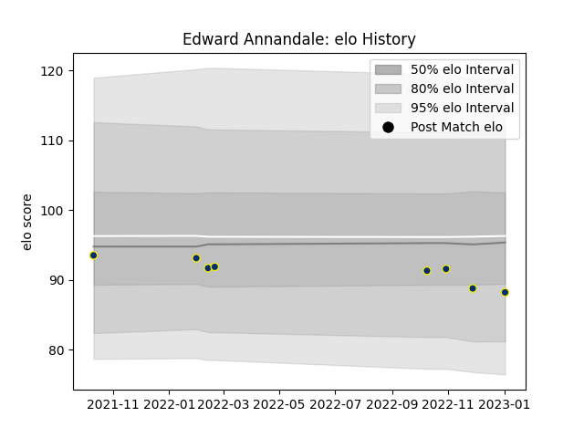

---  
layout: page  
title: Edward Annandale  
date: 2023-01-06 00:25:43.238147  
categories: player  
---
# Edward Annandale

## Positions: L

## Current elo: 95.0

## Current Percentile: None

# Elo History

# Match History

| Team              |   Appearances |   Win Rate |
|:------------------|--------------:|-----------:|
| Clermont Auvergne |             8 |          0 |

| Opponent             |   Matches |   Win Rate |
|:---------------------|----------:|-----------:|
| Stade Toulousain     |         2 |          0 |
| Brive                |         1 |          0 |
| Castres Olympique    |         1 |          0 |
| La Rochelle          |         1 |          0 |
| Pau                  |         1 |          0 |
| Racing 92            |         1 |          0 |
| Stade Francais Paris |         1 |          0 |