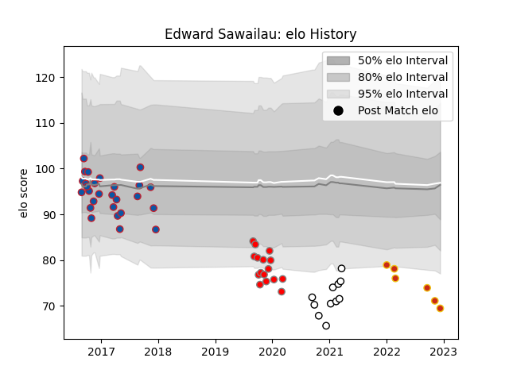

---  
layout: page  
title: Edward Sawailau  
date: 2023-01-17 11:39:11.920778  
categories: player  
---
# Edward Sawailau

## Positions: W, C

## Current elo: 78.0

## Current Percentile: 16.0

# Elo History

# Match History

| Team                       |   Appearances |   Win Rate |
|:---------------------------|--------------:|-----------:|
| Grenoble                   |            30 |   0.316667 |
| Roval Drome XV             |            16 |   0.1875   |
| Valence Romans Drome Rugby |            11 |   0.181818 |
| Perpignan                  |             7 |   0        |

| Opponent             |   Matches |   Win Rate |
|:---------------------|----------:|-----------:|
| Beziers              |         5 |   0.1      |
| Biarritz Olympique   |         4 |   0.25     |
| Perpignan            |         4 |   0        |
| Mont-de-Marsan       |         3 |   0.833333 |
| Colomiers            |         3 |   0.333333 |
| Toulon               |         3 |   0.166667 |
| Montauban            |         3 |   0        |
| Lyon                 |         3 |   0.333333 |
| Vannes               |         3 |   0        |
| Clermont Auvergne    |         2 |   0        |
| Bayonne              |         2 |   0.5      |
| Bordeaux Begles      |         2 |   0        |
| Stade Toulousain     |         2 |   0.5      |
| Racing 92            |         2 |   0        |
| Provence Rugby       |         2 |   0        |
| Castres Olympique    |         2 |   0.5      |
| Aurillac             |         2 |   0.5      |
| Carcassonne          |         2 |   0.5      |
| La Rochelle          |         2 |   0        |
| Brive                |         1 |   1        |
| Montpellier Herault  |         1 |   0        |
| Nevers               |         1 |   0        |
| Ospreys              |         1 |   0        |
| Pau                  |         1 |   0        |
| Bristol Rugby        |         1 |   0        |
| Grenoble             |         1 |   0        |
| Rouen                |         1 |   0        |
| Soyaux-Angouleme     |         1 |   1        |
| Stade Francais Paris |         1 |   0        |
| Glasgow Warriors     |         1 |   0        |
| Dax                  |         1 |   1        |
| Newcastle Falcons    |         1 |   0        |