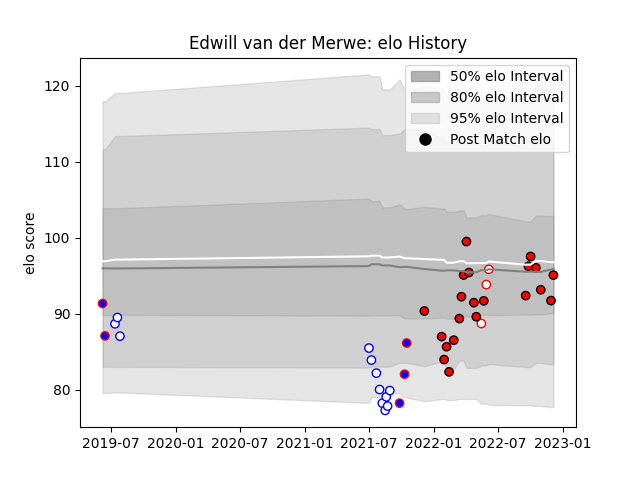

---  
layout: page  
title: Edwill van der Merwe  
date: 2023-02-02 19:08:41.092356  
categories: player  
---
# Edwill van der Merwe

## Positions: W

## Current elo: 113.0

## Current Percentile: 86.0

# Elo History

# Match History

| Team             |   Appearances |   Win Rate |
|:-----------------|--------------:|-----------:|
| Lions            |            29 |   0.465517 |
| Western Province |            14 |   0.464286 |
| Stormers         |             5 |   0.5      |
| Golden Lions     |             3 |   0.666667 |

| Opponent             |   Matches |   Win Rate |
|:---------------------|----------:|-----------:|
| Dragons              |         5 |   0.9      |
| Stormers             |         4 |   0.25     |
| Sharks               |         4 |   0        |
| Natal Sharks         |         4 |   0.75     |
| Blue Bulls           |         3 |   0.333333 |
| Bulls                |         3 |   0        |
| Griquas              |         3 |   0        |
| Benetton Treviso     |         2 |   0.5      |
| Stade Francais Paris |         2 |   0.5      |
| Pumas                |         2 |   0.75     |
| Ospreys              |         2 |   1        |
| Munster              |         2 |   0.5      |
| Golden Lions         |         2 |   0.5      |
| Free State Cheetahs  |         2 |   0.5      |
| Edinburgh            |         2 |   0.75     |
| Connacht             |         2 |   0        |
| Cardiff Blues        |         2 |   1        |
| Leinster             |         1 |   0        |
| Scarlets             |         1 |   1        |
| Sunwolves            |         1 |   1        |
| Ulster               |         1 |   0        |
| Western Province     |         1 |   1        |