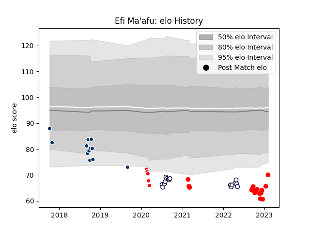

---  
layout: page  
title: Efi Ma'afu  
date: 2023-02-04 17:26:41.811290  
categories: player  
---
# Efi Ma'afu

## Positions: H

## Current elo: 70.0

## Current Percentile: 1.0

# Elo History

# Match History

| Team                  |   Appearances |   Win Rate |
|:----------------------|--------------:|-----------:|
| Melbourne Rebels      |            16 |   0.34375  |
| Rouen                 |            13 |   0.461538 |
| Queensland Country    |            12 |   0.583333 |
| Sunwolves             |             5 |   0        |
| Yokohama Canon Eagles |             3 |   0        |

| Opponent                        |   Matches |   Win Rate |
|:--------------------------------|----------:|-----------:|
| Western Force                   |         5 |   0.6      |
| Queensland Reds                 |         5 |   0.1      |
| Brumbies                        |         4 |   0.25     |
| New South Wales Waratahs        |         3 |   0.333333 |
| Fijian Drua                     |         3 |   0.333333 |
| Crusaders                       |         2 |   0        |
| NSW Country Eagles              |         2 |   1        |
| Saitama Wild Knights            |         1 |   0        |
| Montauban                       |         1 |   1        |
| Perth Spirit                    |         1 |   0        |
| Soyaux-Angouleme                |         1 |   1        |
| Sydney Rays                     |         1 |   1        |
| Oyonnax                         |         1 |   1        |
| Vannes                          |         1 |   1        |
| Nevers                          |         1 |   0        |
| NTT Docomo Red Hurricanes Osaka |         1 |   0        |
| Provence Rugby                  |         1 |   0        |
| Agen                            |         1 |   0        |
| Mont-de-Marsan                  |         1 |   1        |
| Aurillac                        |         1 |   0        |
| Melbourne Rising                |         1 |   1        |
| Kobelco Kobe Steelers           |         1 |   0        |
| Hurricanes                      |         1 |   0        |
| Grenoble                        |         1 |   0        |
| Chiefs                          |         1 |   0        |
| Carcassonne                     |         1 |   0        |
| Canberra Vikings                |         1 |   1        |
| Brisbane City                   |         1 |   0        |
| Blues                           |         1 |   0        |
| Biarritz Olympique              |         1 |   1        |
| Beziers                         |         1 |   0        |
| Moana Pasifika                  |         1 |   1        |