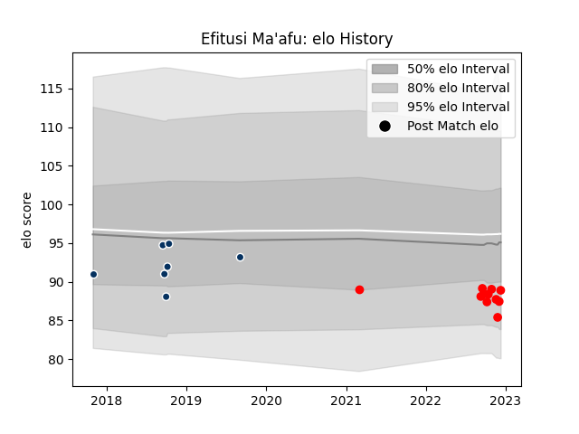

---  
layout: page  
title: Efitusi Ma'afu  
date: 2022-12-14 11:30:08.959298  
categories: player  
---
# Efitusi Ma'afu

## Positions: H

## Current elo: 89.0

## Current Percentile: 17.0

# Elo History

# Match History

| Team                  |   Appearances |   Win Rate |
|:----------------------|--------------:|-----------:|
| Rouen                 |            10 |   0.4      |
| Queensland Country    |             7 |   0.428571 |
| Yokohama Canon Eagles |             1 |   0        |

| Opponent              |   Matches |   Win Rate |
|:----------------------|----------:|-----------:|
| Western Force         |         2 |          0 |
| Montauban             |         1 |          1 |
| Vannes                |         1 |          1 |
| Sydney Rays           |         1 |          1 |
| Provence Rugby        |         1 |          0 |
| Perth Spirit          |         1 |          0 |
| Nevers                |         1 |          0 |
| NSW Country Eagles    |         1 |          1 |
| Agen                  |         1 |          0 |
| Beziers               |         1 |          0 |
| Kobelco Kobe Steelers |         1 |          0 |
| Grenoble              |         1 |          0 |
| Fijian Drua           |         1 |          1 |
| Carcassonne           |         1 |          0 |
| Brisbane City         |         1 |          0 |
| Biarritz Olympique    |         1 |          1 |
| Mont-de-Marsan        |         1 |          1 |