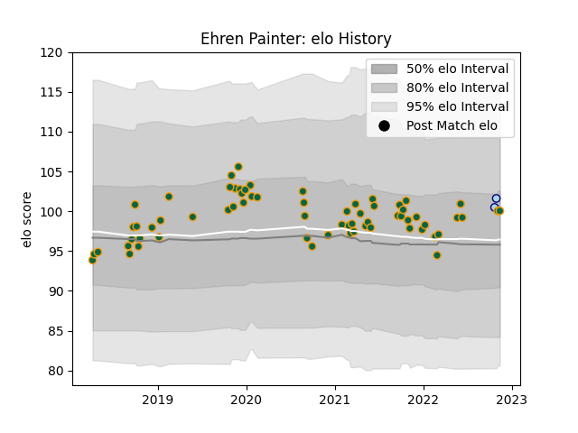

---  
layout: page  
title: Ehren Painter  
date: 2022-12-14 11:27:42.356242  
categories: player  
---
# Ehren Painter

## Positions: P

## Current elo: 101.0

## Current Percentile: 73.0

# Elo History

# Match History

| Team               |   Appearances |   Win Rate |
|:-------------------|--------------:|-----------:|
| Northampton Saints |            67 |    0.41791 |
| Bedford            |             2 |    0.5     |

| Opponent           |   Matches |   Win Rate |
|:-------------------|----------:|-----------:|
| Bath Rugby         |         6 |   0.166667 |
| Sale Sharks        |         6 |   0.333333 |
| Exeter Chiefs      |         6 |   0.5      |
| Gloucester Rugby   |         6 |   0.5      |
| Bristol Rugby      |         5 |   0.2      |
| Saracens           |         5 |   0.2      |
| Leicester Tigers   |         5 |   0.4      |
| Harlequins         |         5 |   0.4      |
| London Irish       |         4 |   0.75     |
| Wasps              |         4 |   0.25     |
| Newcastle Falcons  |         3 |   0.666667 |
| Worcester Warriors |         3 |   1        |
| Leinster           |         2 |   0        |
| Lyon               |         2 |   1        |
| Dragons            |         2 |   1        |
| Clermont Auvergne  |         2 |   0        |
| Hartpury College   |         1 |   1        |
| La Rochelle        |         1 |   0        |
| Richmond           |         1 |   0        |