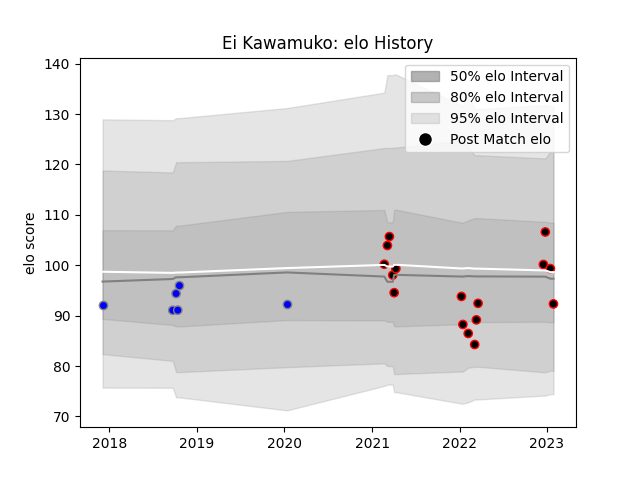

---  
layout: page  
title: Ei Kawamuko  
date: 2022-12-28 12:56:51.261716  
categories: player  
---
# Ei Kawamuko

## Positions: FH

## Current elo: 90.0

## Current Percentile: 22.0

# Elo History

# Match History

| Team                              |   Appearances |   Win Rate |
|:----------------------------------|--------------:|-----------:|
| NTT Docomo Red Hurricanes Osaka   |            14 |   0.428571 |
| Kubota Spears Funabashi Tokyo-Bay |             6 |   0.833333 |

| Opponent                  |   Matches |   Win Rate |
|:--------------------------|----------:|-----------:|
| Black Rams Tokyo          |         3 |   0.666667 |
| Saitama Wild Knights      |         3 |   0        |
| Toshiba Brave Lupus Tokyo |         2 |   0.5      |
| Yokohama Canon Eagles     |         2 |   0.5      |
| Chugoku Red Regulions     |         1 |   1        |
| Coca-Cola Red Sparks      |         1 |   1        |
| Green Rockets Tokatsu     |         1 |   1        |
| Hino Red Dolphins         |         1 |   1        |
| Kobelco Kobe Steelers     |         1 |   0        |
| Kyuden Voltex             |         1 |   1        |
| Mie Honda Heat            |         1 |   1        |
| Munakata Sanix Blues      |         1 |   1        |
| Shizuoka Blue Revs        |         1 |   0        |
| Tokyo Sungoliath          |         1 |   0        |