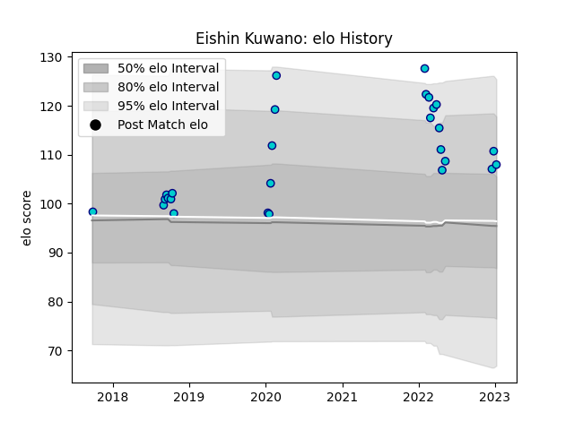

---  
layout: page  
title: Eishin Kuwano  
date: 2023-03-21 18:39:36.878993  
categories: player  
---
# Eishin Kuwano

Last updated: 2023-03-21
## Positions: L

## Current elo: 144.0

## Current Percentile: 95.0

# Elo History

# Match History

| Team               |   Appearances |   Win Rate |
|:-------------------|--------------:|-----------:|
| Shizuoka Blue Revs |            38 |   0.578947 |

| Opponent                          |   Matches |   Win Rate |
|:----------------------------------|----------:|-----------:|
| Black Rams Tokyo                  |         5 |      0.8   |
| Toyota Verblitz                   |         5 |      0.6   |
| Toshiba Brave Lupus Tokyo         |         4 |      0.25  |
| Yokohama Canon Eagles             |         4 |      0.625 |
| Saitama Wild Knights              |         3 |      0     |
| Green Rockets Tokatsu             |         2 |      1     |
| Kobelco Kobe Steelers             |         2 |      0     |
| Kubota Spears Funabashi Tokyo-Bay |         2 |      0.5   |
| Mitsubishi Dynaboars              |         2 |      0.75  |
| NTT Docomo Red Hurricanes Osaka   |         2 |      1     |
| Tokyo Sungoliath                  |         2 |      0     |
| Coca-Cola Red Sparks              |         1 |      1     |
| Hanazono Kintetsu Liners          |         1 |      1     |
| Hino Red Dolphins                 |         1 |      1     |
| Mie Honda Heat                    |         1 |      1     |
| Urayasu D-Rocks                   |         1 |      1     |