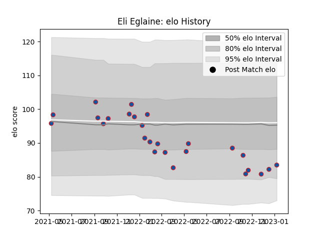

---  
layout: page  
title: Eli Eglaine  
date: 2023-03-17 17:28:55.433234  
categories: player  
---
# Eli Eglaine

## Positions: P

## Current elo: 88.0

## Current Percentile: 29.0

# Elo History

# Match History

| Team     |   Appearances |   Win Rate |
|:---------|--------------:|-----------:|
| Grenoble |            28 |   0.482143 |

| Opponent       |   Matches |   Win Rate |
|:---------------|----------:|-----------:|
| Vannes         |         4 |   0.5      |
| Provence Rugby |         3 |   0.166667 |
| Agen           |         2 |   0.5      |
| Aurillac       |         2 |   1        |
| Bayonne        |         2 |   0.5      |
| Carcassonne    |         2 |   0.75     |
| Colomiers      |         2 |   0        |
| Mont-de-Marsan |         2 |   0.5      |
| Montauban      |         2 |   0.75     |
| Oyonnax        |         2 |   0        |
| Rouen          |         2 |   0.5      |
| US Bressane    |         2 |   0.5      |
| Massy          |         1 |   1        |