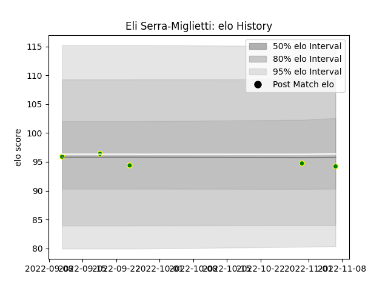

---  
layout: page  
title: Eli Serra-Miglietti  
date: 2023-01-15 11:47:02.498100  
categories: player  
---
# Eli Serra-Miglietti

## Positions: P

## Current elo: 90.0

## Current Percentile: 22.0

# Elo History

# Match History

| Team                |   Appearances |   Win Rate |
|:--------------------|--------------:|-----------:|
| Carqueiranne-Hyères |             9 |   0.333333 |
| Massy               |             1 |   1        |

| Opponent                   |   Matches |   Win Rate |
|:---------------------------|----------:|-----------:|
| Blagnac                    |         2 |        0.5 |
| Suresnes                   |         2 |        0.5 |
| Albi                       |         1 |        1   |
| Bourgoin-Jallieu           |         1 |        0   |
| Cognac Saint Jean d'Angély |         1 |        1   |
| Dax                        |         1 |        0   |
| Rennes                     |         1 |        0   |
| Valence Romans Drome Rugby |         1 |        0   |