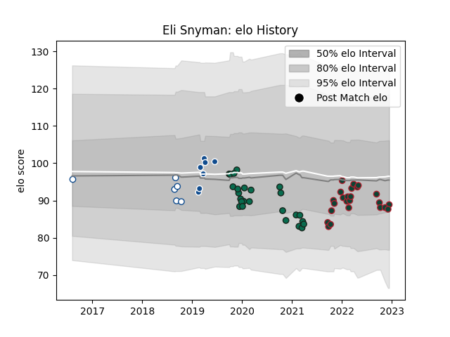

---  
layout: page  
title: Eli Snyman  
date: 2022-11-16 11:43:18.734349  
categories: player  
---
# Eli Snyman

## Positions: L

## Current elo: 85.0

## Current Percentile: 20.0

# Elo History

# Match History

| Team             |   Appearances |   Win Rate |
|:-----------------|--------------:|-----------:|
| Benetton Treviso |            25 |   0.24     |
| Leicester Tigers |            22 |   0.681818 |
| Bulls            |             7 |   0.571429 |
| Blue Bulls       |             4 |   0.5      |

| Opponent           |   Matches |   Win Rate |
|:-------------------|----------:|-----------:|
| Cardiff Blues      |         4 |   0        |
| Northampton Saints |         4 |   0.5      |
| Bath Rugby         |         3 |   0.666667 |
| Connacht           |         3 |   0.333333 |
| Exeter Chiefs      |         3 |   0.666667 |
| Leinster           |         3 |   0        |
| Jaguares           |         2 |   0        |
| Worcester Warriors |         2 |   1        |
| Scarlets           |         2 |   0        |
| Saracens           |         2 |   0        |
| Munster            |         2 |   0        |
| Lyon               |         2 |   0.5      |
| Lions              |         2 |   1        |
| London Irish       |         2 |   1        |
| Zebre              |         2 |   1        |
| Gloucester Rugby   |         2 |   1        |
| Glasgow Warriors   |         2 |   0        |
| Sharks             |         1 |   1        |
| Chiefs             |         1 |   0        |
| Western Province   |         1 |   0        |
| Wasps              |         1 |   0        |
| Ulster             |         1 |   0        |
| Stormers           |         1 |   1        |
| Southern Kings     |         1 |   1        |
| Harlequins         |         1 |   0        |
| Dragons            |         1 |   1        |
| Griquas            |         1 |   1        |
| Sale Sharks        |         1 |   0        |
| Pumas              |         1 |   1        |
| Newcastle Falcons  |         1 |   1        |
| Golden Lions       |         1 |   0        |
| Bristol Rugby      |         1 |   1        |
| Edinburgh          |         1 |   1        |