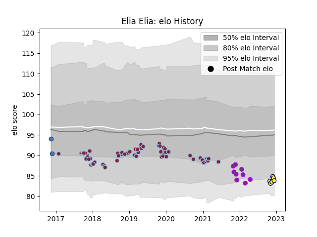

---  
layout: page  
title: Elia Elia  
date: 2023-01-13 11:24:25.475706  
categories: player  
---
# Elia Elia

## Positions: H

## Country: Samoa

## Current elo: 94.0

## Current Percentile: 48.0

# Elo History

# Match History

| Team        |   Appearances |   Win Rate |
|:------------|--------------:|-----------:|
| Harlequins  |            62 |   0.483871 |
| US Bressane |            17 |   0.382353 |
| Nevers      |             8 |   0.375    |
| Samoa       |             3 |   0.333333 |

| Opponent           |   Matches |   Win Rate |
|:-------------------|----------:|-----------:|
| Worcester Warriors |         7 |   0.571429 |
| Wasps              |         7 |   0.571429 |
| Sale Sharks        |         6 |   0.5      |
| Gloucester Rugby   |         5 |   0.6      |
| Bath Rugby         |         5 |   0.6      |
| Ulster             |         4 |   0        |
| Saracens           |         4 |   0.75     |
| Northampton Saints |         4 |   0.25     |
| Vannes             |         3 |   0        |
| Newcastle Falcons  |         3 |   0.666667 |
| Aurillac           |         3 |   0.333333 |
| Grenoble           |         3 |   0.333333 |
| Agen               |         3 |   1        |
| Leicester Tigers   |         3 |   0.833333 |
| Beziers            |         3 |   1        |
| Exeter Chiefs      |         3 |   0        |
| Bristol Rugby      |         3 |   0.666667 |
| Narbonne           |         2 |   0.5      |
| Oyonnax            |         2 |   0        |
| Nevers             |         2 |   0        |
| Clermont Auvergne  |         2 |   0        |
| Mont-de-Marsan     |         2 |   0        |
| La Rochelle        |         2 |   0        |
| Montauban          |         1 |   0.5      |
| France             |         1 |   0        |
| Carcassonne        |         1 |   0        |
| Canada             |         1 |   1        |
| London Irish       |         1 |   0.5      |
| Soyaux-Angouleme   |         1 |   1        |
| Benetton Treviso   |         1 |   1        |
| Bayonne            |         1 |   0        |
| Georgia            |         1 |   0        |