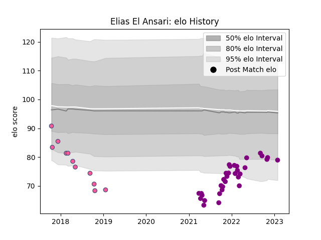

---  
layout: page  
title: Elias El Ansari  
date: 2023-01-30 11:46:31.809836  
categories: player  
---
# Elias El Ansari

## Positions: P

## Current elo: 79.0

## Current Percentile: 7.0

# Elo History

# Match History

| Team                 |   Appearances |   Win Rate |
|:---------------------|--------------:|-----------:|
| Soyaux-Angouleme     |            32 |  0.53125   |
| Stade Francais Paris |            11 |  0.0909091 |

| Opponent                   |   Matches |   Win Rate |
|:---------------------------|----------:|-----------:|
| Colomiers                  |         3 |   0.333333 |
| Worcester Warriors         |         2 |   0        |
| Chambery                   |         2 |   0        |
| Nice                       |         2 |   0.5      |
| Krasny Yar                 |         2 |   0.5      |
| Dijon                      |         2 |   0.5      |
| Dax                        |         2 |   0.5      |
| Cognac Saint Jean d'Angély |         2 |   1        |
| Massy                      |         2 |   0.5      |
| Bourgoin-Jallieu           |         2 |   1        |
| Suresnes                   |         2 |   1        |
| Aubenas                    |         2 |   1        |
| Nevers                     |         1 |   0        |
| Rouen                      |         1 |   0        |
| Toulon                     |         1 |   0        |
| Valence Romans Drome Rugby |         1 |   1        |
| Pau                        |         1 |   0        |
| Oyonnax                    |         1 |   0        |
| Provence Rugby             |         1 |   0        |
| Agen                       |         1 |   1        |
| Montauban                  |         1 |   0        |
| Lyon                       |         1 |   0        |
| London Irish               |         1 |   0        |
| Albi                       |         1 |   1        |
| Clermont Auvergne          |         1 |   0        |
| Carcassonne                |         1 |   0        |
| Blagnac                    |         1 |   1        |
| Biarritz Olympique         |         1 |   0        |
| Aurillac                   |         1 |   0        |
| La Rochelle                |         1 |   0        |