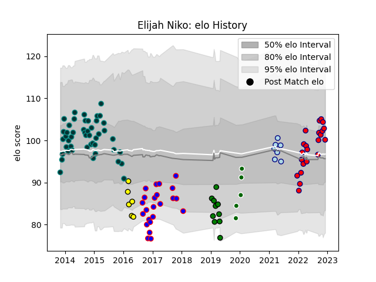

---  
layout: page  
title: Elijah Niko  
date: 2023-03-17 17:27:49.846866  
categories: player  
---
# Elijah Niko

## Positions: W, C

## Current elo: 94.0

## Current Percentile: 36.0

# Elo History

# Match History

| Team                |   Appearances |   Win Rate |
|:--------------------|--------------:|-----------:|
| Pau                 |            50 |   0.59     |
| Beziers             |            27 |   0.481481 |
| Aurillac            |            22 |   0.590909 |
| Yorkshire Carnegie  |            10 |   0.7      |
| Bedford             |             8 |   0.375    |
| Albi                |             7 |   0.357143 |
| Ealing Trailfinders |             6 |   0.916667 |

| Opponent             |   Matches |   Win Rate |
|:---------------------|----------:|-----------:|
| Colomiers            |         7 |   0.857143 |
| Bourgoin-Jallieu     |         7 |   0.714286 |
| Montauban            |         7 |   0.428571 |
| Carcassonne          |         7 |   0.571429 |
| Narbonne             |         6 |   0.5      |
| Mont-de-Marsan       |         6 |   0.25     |
| Dax                  |         5 |   0.7      |
| Aurillac             |         5 |   1        |
| Albi                 |         5 |   0.8      |
| Perpignan            |         5 |   0.4      |
| Agen                 |         5 |   0.6      |
| Biarritz Olympique   |         5 |   0.4      |
| Beziers              |         4 |   1        |
| Grenoble             |         4 |   0        |
| Soyaux-Angouleme     |         3 |   0.666667 |
| Massy                |         3 |   1        |
| Cornish Pirates      |         3 |   0.333333 |
| Coventry             |         3 |   0.5      |
| Oyonnax              |         3 |   0.333333 |
| Nottingham           |         3 |   0.666667 |
| Tarbes               |         3 |   0.666667 |
| Nevers               |         2 |   1        |
| US Bressane          |         2 |   0.5      |
| Provence Rugby       |         2 |   0.5      |
| La Rochelle          |         2 |   0        |
| Ampthill             |         2 |   1        |
| Hartpury College     |         2 |   1        |
| Ealing Trailfinders  |         2 |   0        |
| Doncaster            |         2 |   1        |
| Lyon                 |         1 |   0        |
| Sale Sharks          |         1 |   0        |
| Vannes               |         1 |   0        |
| Auch                 |         1 |   0        |
| Stade Francais Paris |         1 |   0        |
| Bayonne              |         1 |   0        |
| Saracens             |         1 |   0        |
| Bedford              |         1 |   1        |
| Richmond             |         1 |   1        |
| London Scottish      |         1 |   1        |
| Castres Olympique    |         1 |   0        |
| Dragons              |         1 |   0        |
| Jersey               |         1 |   0        |
| London Irish         |         1 |   1        |
| Yorkshire Carnegie   |         1 |   1        |