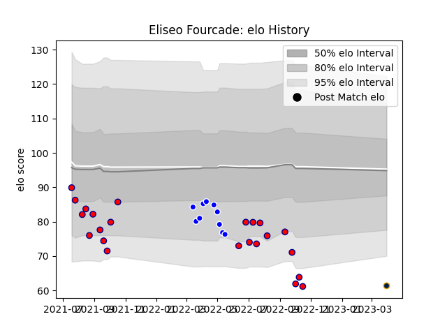

---  
layout: page  
title: Eliseo Fourcade  
date: 2023-03-30 11:33:09.013053  
categories: player  
---
# Eliseo Fourcade

Last updated: 2023-03-30
## Positions: L, FL

## Current elo: 62.0

## Current Percentile: 2.0

# Elo History

# Match History

| Team          |   Appearances |   Win Rate |
|:--------------|--------------:|-----------:|
| Pucara        |            23 |   0.347826 |
| Cafeteros Pro |            10 |   0.4      |
| Pampas XV     |             1 |   1        |

| Opponent             |   Matches |   Win Rate |
|:---------------------|----------:|-----------:|
| SIC                  |         3 |   0        |
| Regatas Bella Vista  |         3 |   0.666667 |
| Penarol Rugby        |         3 |   0.333333 |
| Alumni               |         2 |   0.5      |
| Atlético del Rosario |         2 |   0.25     |
| San Luis             |         2 |   0.25     |
| Olimpia Lions        |         2 |   1        |
| Los Tilos            |         2 |   0.5      |
| Jaguares XV          |         2 |   0        |
| Hindu                |         2 |   0        |
| Cobras               |         2 |   1        |
| CASI                 |         2 |   1        |
| Buenos Aires         |         2 |   0.5      |
| Selknam              |         2 |   0        |
| Newman               |         1 |   0        |
| CUBA                 |         1 |   0        |
| Belgrano             |         1 |   0        |