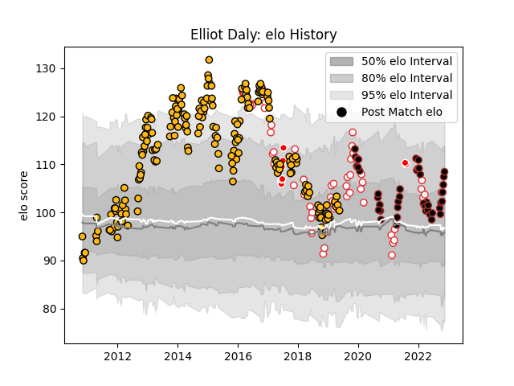

---  
layout: page  
title: Elliot Daly  
date: 2023-01-06 00:17:34.652531  
categories: player  
---
# Elliot Daly

## Positions: C, FB

## Country: England

## Current elo: 114.0

## Current Percentile: 77.0

# Elo History

# Match History

| Team                    |   Appearances |   Win Rate |
|:------------------------|--------------:|-----------:|
| Wasps                   |           195 |   0.517949 |
| England                 |            55 |   0.681818 |
| Saracens                |            47 |   0.819149 |
| British and Irish Lions |            11 |   0.5      |

| Opponent                 |   Matches |   Win Rate |
|:-------------------------|----------:|-----------:|
| Exeter Chiefs            |        24 |   0.375    |
| Bath Rugby               |        21 |   0.52381  |
| Harlequins               |        18 |   0.444444 |
| Northampton Saints       |        17 |   0.588235 |
| Saracens                 |        17 |   0.117647 |
| Leicester Tigers         |        16 |   0.5625   |
| Worcester Warriors       |        15 |   0.8      |
| Gloucester Rugby         |        15 |   0.666667 |
| London Irish             |        14 |   0.678571 |
| Newcastle Falcons        |        12 |   0.791667 |
| Sale Sharks              |         9 |   0.555556 |
| Wales                    |         9 |   0.666667 |
| Leinster                 |         9 |   0.388889 |
| South Africa             |         9 |   0.444444 |
| Ireland                  |         8 |   0.5      |
| France                   |         7 |   0.571429 |
| Bristol Rugby            |         5 |   1        |
| Bayonne                  |         5 |   0.7      |
| Scotland                 |         5 |   0.5      |
| Australia                |         5 |   1        |
| New Zealand              |         5 |   0.5      |
| Stade Toulousain         |         4 |   0.375    |
| London Welsh             |         4 |   1        |
| Italy                    |         4 |   1        |
| Dragons                  |         3 |   0.666667 |
| Argentina                |         3 |   1        |
| Toulon                   |         3 |   0.333333 |
| La Rochelle              |         2 |   0.5      |
| Racing 92                |         2 |   0.5      |
| Zebre                    |         2 |   1        |
| Grenoble                 |         2 |   1        |
| Edinburgh                |         2 |   0.5      |
| Yorkshire Carnegie       |         2 |   1        |
| Rovigo                   |         1 |   1        |
| Tonga                    |         1 |   1        |
| Ulster                   |         1 |   0        |
| United States of America |         1 |   1        |
| Wasps                    |         1 |   0        |
| Provincial Union XV      |         1 |   1        |
| Ospreys                  |         1 |   1        |
| Nottingham               |         1 |   1        |
| Samoa                    |         1 |   1        |
| Ampthill                 |         1 |   1        |
| New Zealand Maori        |         1 |   1        |
| Munster                  |         1 |   1        |
| Arix Viadana             |         1 |   1        |
| Barbarians               |         1 |   0        |
| Bedford                  |         1 |   1        |
| Biarritz Olympique       |         1 |   0        |
| Blues                    |         1 |   0        |
| Bordeaux Begles          |         1 |   1        |
| Brive                    |         1 |   1        |
| Cardiff Blues            |         1 |   0        |
| Chiefs                   |         1 |   1        |
| Coventry                 |         1 |   1        |
| Doncaster                |         1 |   1        |
| Ealing Trailfinders      |         1 |   1        |
| Fiji                     |         1 |   1        |
| Highlanders              |         1 |   0        |
| Japan                    |         1 |   1        |
| Lyon                     |         1 |   1        |
| Mogliano                 |         1 |   1        |
| Leeds                    |         1 |   1        |