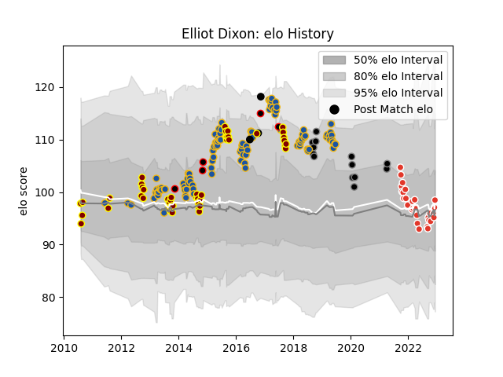

---  
layout: page  
title: Elliot Dixon  
date: 2022-11-22 11:42:16.377489  
categories: player  
---
# Elliot Dixon

## Positions: FL, N8

## Country: New Zealand

## Current elo: 96.0

## Current Percentile: 46.0

# Elo History

# Match History

| Team               |   Appearances |   Win Rate |
|:-------------------|--------------:|-----------:|
| Highlanders        |           104 |   0.524038 |
| Southland          |            48 |   0.416667 |
| Biarritz Olympique |            25 |   0.22     |
| Black Rams Tokyo   |            13 |   0.615385 |
| New Zealand Maori  |             5 |   0.8      |
| New Zealand        |             3 |   1        |

| Opponent                  |   Matches |   Win Rate |
|:--------------------------|----------:|-----------:|
| Hurricanes                |        14 |   0.428571 |
| Crusaders                 |        14 |   0.214286 |
| Chiefs                    |        13 |   0.5      |
| Blues                     |        11 |   0.727273 |
| New South Wales Waratahs  |         8 |   0.625    |
| Brumbies                  |         7 |   0.571429 |
| Manawatu                  |         7 |   0.428571 |
| Lions                     |         7 |   0.428571 |
| Hawke's Bay               |         7 |   0.357143 |
| Tasman                    |         6 |   0.166667 |
| Otago                     |         5 |   0.6      |
| North Harbour             |         5 |   0.6      |
| Sharks                    |         5 |   0.6      |
| Melbourne Rebels          |         5 |   0.6      |
| Western Force             |         5 |   0.6      |
| Bay of Plenty             |         5 |   0.6      |
| Bulls                     |         4 |   0.75     |
| Queensland Reds           |         3 |   0.333333 |
| Northland                 |         3 |   0.666667 |
| Stormers                  |         3 |   0.333333 |
| Taranaki                  |         3 |   0        |
| Waikato                   |         2 |   0.5      |
| Pau                       |         2 |   0        |
| Montpellier Herault       |         2 |   0        |
| Shizuoka Blue Revs        |         2 |   0        |
| Stade Francais Paris      |         2 |   0.5      |
| Mie Honda Heat            |         2 |   0.5      |
| Clermont Auvergne         |         2 |   0        |
| Cheetahs                  |         2 |   1        |
| Japan                     |         2 |   1        |
| Jaguares                  |         2 |   1        |
| Canterbury                |         2 |   0.5      |
| Green Rockets Tokatsu     |         2 |   1        |
| Castres Olympique         |         2 |   0        |
| Toulon                    |         2 |   0        |
| Lyon                      |         2 |   0        |
| Sunwolves                 |         1 |   1        |
| Stade Toulousain          |         1 |   0        |
| Racing 92                 |         1 |   0        |
| Toshiba Brave Lupus Tokyo |         1 |   0        |
| Vannes                    |         1 |   0        |
| Wales                     |         1 |   1        |
| Saitama Wild Knights      |         1 |   1        |
| Wellington                |         1 |   0        |
| United States of America  |         1 |   1        |
| Agen                      |         1 |   0        |
| Nevers                    |         1 |   0.5      |
| Munakata Sanix Blues      |         1 |   1        |
| Auckland                  |         1 |   0.5      |
| British and Irish Lions   |         1 |   0        |
| Brive                     |         1 |   1        |
| Canada                    |         1 |   1        |
| Carcassonne               |         1 |   1        |
| Coca-Cola Red Sparks      |         1 |   1        |
| Counties Manukau          |         1 |   0        |
| Hino Red Dolphins         |         1 |   1        |
| Italy                     |         1 |   1        |
| Kobelco Kobe Steelers     |         1 |   0        |
| La Rochelle               |         1 |   0        |
| Massy                     |         1 |   1        |
| Argentina                 |         1 |   1        |
| Mont-de-Marsan            |         1 |   0        |
| Montauban                 |         1 |   1        |
| Yokohama Canon Eagles     |         1 |   1        |