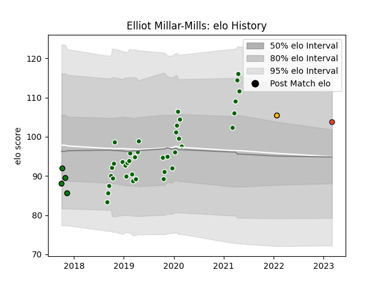

---  
layout: page  
title: Elliot Millar-Mills  
date: 2023-03-06 11:24:44.713930  
categories: player  
---
# Elliot Millar-Mills

## Positions: P

## Current elo: 104.0

## Current Percentile: None

# Elo History

# Match History

| Team                |   Appearances |   Win Rate |
|:--------------------|--------------:|-----------:|
| Ealing Trailfinders |            38 |   0.815789 |
| Yorkshire Carnegie  |             4 |   0.5      |
| Edinburgh           |             1 |   0        |
| Wasps               |             1 |   0        |

| Opponent            |   Matches |   Win Rate |
|:--------------------|----------:|-----------:|
| Cornish Pirates     |         5 |   0.8      |
| Jersey              |         5 |   1        |
| Bedford             |         5 |   0.8      |
| Coventry            |         4 |   1        |
| Hartpury College    |         4 |   1        |
| Nottingham          |         4 |   0.75     |
| Richmond            |         3 |   0.333333 |
| London Scottish     |         3 |   1        |
| Yorkshire Carnegie  |         2 |   1        |
| Doncaster           |         2 |   1        |
| Newcastle Falcons   |         1 |   0        |
| Saracens            |         1 |   0        |
| Ampthill            |         1 |   1        |
| Munster             |         1 |   0        |
| London Irish        |         1 |   0        |
| Ealing Trailfinders |         1 |   0        |
| Leinster            |         1 |   0        |