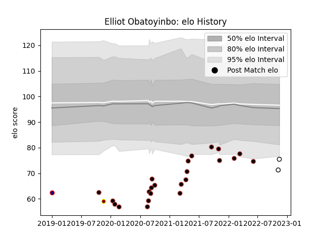

---  
layout: page  
title: Elliot Obatoyinbo  
date: 2022-11-16 11:21:21.266898  
categories: player  
---
# Elliot Obatoyinbo

## Positions: FB

## Current elo: 95.0

## Current Percentile: 3.0

# Elo History

# Match History

| Team              |   Appearances |   Win Rate |
|:------------------|--------------:|-----------:|
| Saracens          |            23 |   0.586957 |
| Newcastle Falcons |             2 |   0.5      |
| Ampthill          |             1 |   0        |
| London Scottish   |             1 |   0        |

| Opponent            |   Matches |   Win Rate |
|:--------------------|----------:|-----------:|
| Harlequins          |         3 |   0.666667 |
| Gloucester Rugby    |         3 |   0.666667 |
| Wasps               |         2 |   0        |
| Bristol Rugby       |         2 |   0.5      |
| Cornish Pirates     |         2 |   0        |
| Bath Rugby          |         2 |   0.5      |
| Jersey              |         2 |   0.5      |
| Newcastle Falcons   |         1 |   1        |
| Sale Sharks         |         1 |   0        |
| Ospreys             |         1 |   1        |
| Northampton Saints  |         1 |   0        |
| Ampthill            |         1 |   1        |
| London Irish        |         1 |   0.5      |
| Exeter Chiefs       |         1 |   1        |
| Ealing Trailfinders |         1 |   1        |
| Doncaster           |         1 |   1        |
| Bedford             |         1 |   1        |
| Worcester Warriors  |         1 |   0        |