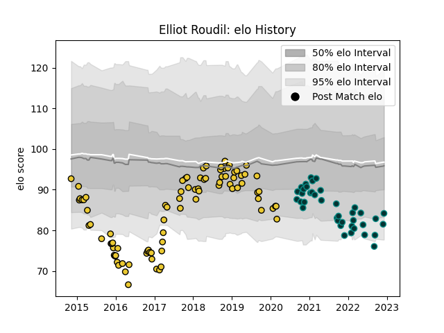

---  
layout: page  
title: Elliot Roudil  
date: 2022-12-09 13:17:44.641902  
categories: player  
---
# Elliot Roudil

## Positions: W, C

## Current elo: 84.0

## Current Percentile: 9.0

# Elo History

# Match History

| Team        |   Appearances |   Win Rate |
|:------------|--------------:|-----------:|
| La Rochelle |            86 |   0.534884 |
| Pau         |            39 |   0.423077 |

| Opponent             |   Matches |   Win Rate |
|:---------------------|----------:|-----------:|
| Montpellier Herault  |        12 |   0.458333 |
| Toulon               |        10 |   0.5      |
| Clermont Auvergne    |        10 |   0.3      |
| Stade Francais Paris |        10 |   0.55     |
| Lyon                 |         8 |   0.625    |
| Brive                |         8 |   0.625    |
| Stade Toulousain     |         7 |   0.571429 |
| Castres Olympique    |         7 |   0.142857 |
| Racing 92            |         7 |   0.214286 |
| Bordeaux Begles      |         6 |   0.5      |
| Bayonne              |         4 |   0.75     |
| Pau                  |         4 |   0.5      |
| La Rochelle          |         3 |   0        |
| Zebre                |         3 |   0.666667 |
| Perpignan            |         3 |   1        |
| Gloucester Rugby     |         3 |   0        |
| Bristol Rugby        |         3 |   0.666667 |
| Oyonnax              |         3 |   0.333333 |
| Worcester Warriors   |         2 |   0.5      |
| Agen                 |         2 |   1        |
| Grenoble             |         2 |   1        |
| RC Enisei            |         1 |   1        |
| Exeter Chiefs        |         1 |   0        |
| Edinburgh            |         1 |   1        |
| Connacht             |         1 |   0        |
| Biarritz Olympique   |         1 |   1        |
| Ulster               |         1 |   1        |
| Benetton Treviso     |         1 |   1        |
| Harlequins           |         1 |   1        |