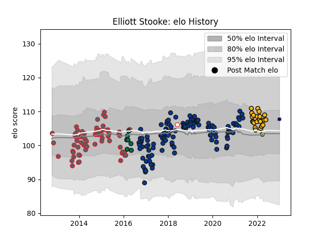

---  
layout: page  
title: Elliott Stooke  
date: 2023-02-02 18:54:41.093049  
categories: player  
---
# Elliott Stooke

## Positions: L

## Country: England

## Current elo: 96.0

## Current Percentile: 53.0

# Elo History

# Match History

| Team                |   Appearances |   Win Rate |
|:--------------------|--------------:|-----------:|
| Bath Rugby          |           123 |   0.50813  |
| Gloucester Rugby    |            72 |   0.5625   |
| Wasps               |            24 |   0.479167 |
| London Irish        |             7 |   0        |
| Bristol Rugby       |             3 |   1        |
| Montpellier Herault |             3 |   0.166667 |
| England             |             1 |   0        |

| Opponent             |   Matches |   Win Rate |
|:---------------------|----------:|-----------:|
| Exeter Chiefs        |        21 |   0.333333 |
| Worcester Warriors   |        18 |   0.722222 |
| Leicester Tigers     |        17 |   0.529412 |
| Harlequins           |        16 |   0.5      |
| Wasps                |        16 |   0.25     |
| Northampton Saints   |        15 |   0.633333 |
| Newcastle Falcons    |        15 |   0.6      |
| Saracens             |        14 |   0.285714 |
| London Irish         |        12 |   0.916667 |
| Bristol Rugby        |        12 |   0.416667 |
| Sale Sharks          |        12 |   0.291667 |
| Gloucester Rugby     |        11 |   0.545455 |
| Bath Rugby           |         8 |   0.375    |
| Zebre                |         5 |   1        |
| London Welsh         |         3 |   1        |
| Ospreys              |         3 |   0.333333 |
| Perpignan            |         3 |   1        |
| Scarlets             |         3 |   0.333333 |
| Stade Toulousain     |         3 |   0        |
| Leinster             |         2 |   0        |
| Toulon               |         2 |   0.5      |
| Edinburgh            |         2 |   0.5      |
| Munster              |         2 |   0        |
| Clermont Auvergne    |         2 |   0        |
| Cardiff Blues        |         2 |   0.5      |
| Oyonnax              |         2 |   1        |
| Pau                  |         2 |   1        |
| Brive                |         2 |   1        |
| Benetton Treviso     |         2 |   1        |
| Ulster               |         1 |   0        |
| Barbarians           |         1 |   0        |
| Stade Francais Paris |         1 |   0        |
| La Rochelle          |         1 |   1        |
| Dragons              |         1 |   0        |
| Mont-de-Marsan       |         1 |   1        |