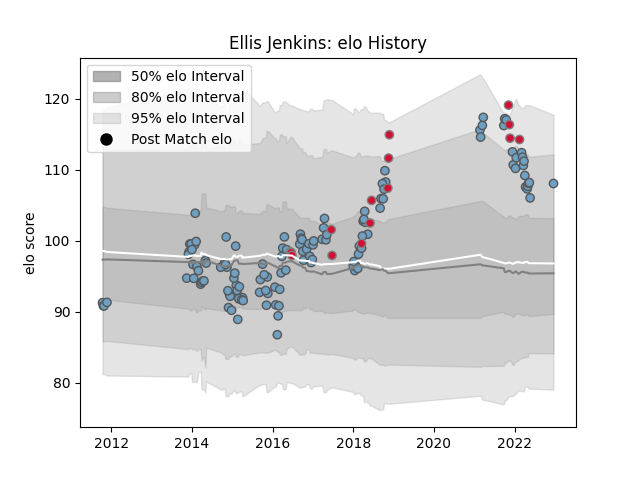

---  
layout: page  
title: Ellis Jenkins  
date: 2023-01-06 00:17:53.312278  
categories: player  
---
# Ellis Jenkins

## Positions: FL

## Country: Wales

## Current elo: 116.0

## Current Percentile: 85.0

# Elo History

# Match History

| Team          |   Appearances |   Win Rate |
|:--------------|--------------:|-----------:|
| Cardiff Blues |           130 |   0.515385 |
| Wales         |            15 |   0.666667 |

| Opponent          |   Matches |   Win Rate |
|:------------------|----------:|-----------:|
| Dragons           |        10 |   0.7      |
| Benetton Treviso  |        10 |   0.55     |
| Glasgow Warriors  |        10 |   0.4      |
| Munster           |        10 |   0.4      |
| Edinburgh         |         9 |   0.777778 |
| Scarlets          |         9 |   0.333333 |
| Ospreys           |         9 |   0.222222 |
| Ulster            |         8 |   0.4375   |
| Zebre             |         7 |   0.714286 |
| Connacht          |         7 |   0.571429 |
| Leinster          |         5 |   0        |
| Harlequins        |         4 |   0.25     |
| South Africa      |         3 |   0.666667 |
| Cheetahs          |         3 |   0.666667 |
| New Zealand       |         3 |   0        |
| Newcastle Falcons |         3 |   0.666667 |
| Lyon              |         2 |   1        |
| Pau               |         2 |   1        |
| London Irish      |         2 |   0.5      |
| Rovigo            |         2 |   1        |
| Stade Toulousain  |         2 |   0.5      |
| Tonga             |         2 |   1        |
| Calvisano         |         2 |   1        |
| Bath Rugby        |         2 |   0        |
| Australia         |         2 |   1        |
| Southern Kings    |         1 |   1        |
| Sharks            |         1 |   1        |
| Toulon            |         1 |   0        |
| Wasps             |         1 |   1        |
| Stormers          |         1 |   0        |
| Aironi            |         1 |   1        |
| Samoa             |         1 |   1        |
| Argentina         |         1 |   1        |
| Leicester Tigers  |         1 |   0        |
| Italy             |         1 |   1        |
| Ireland           |         1 |   0        |
| Grenoble          |         1 |   1        |
| Gloucester Rugby  |         1 |   1        |
| Fiji              |         1 |   1        |
| Exeter Chiefs     |         1 |   0        |
| Bristol Rugby     |         1 |   1        |
| Lions             |         1 |   0        |