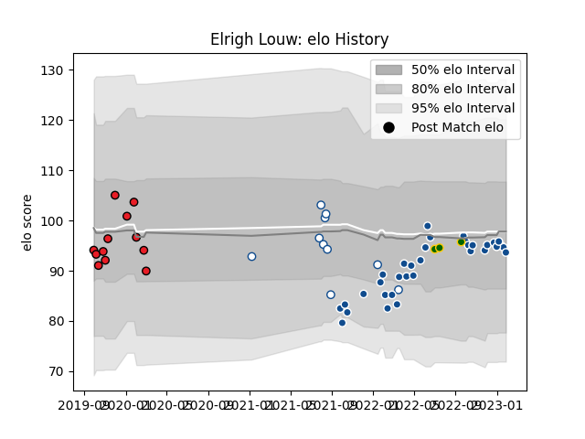

---  
layout: page  
title: Elrigh Louw  
date: 2023-02-02 19:05:10.507964  
categories: player  
---
# Elrigh Louw

## Positions: N8

## Country: South Africa

## Current elo: 94.0

## Current Percentile: 42.0

# Elo History

# Match History

| Team           |   Appearances |   Win Rate |
|:---------------|--------------:|-----------:|
| Bulls          |            33 |  0.575758  |
| Southern Kings |            12 |  0.0833333 |
| Blue Bulls     |            10 |  0.9       |
| South Africa   |             3 |  1         |

| Opponent            |   Matches |   Win Rate |
|:--------------------|----------:|-----------:|
| Connacht            |         4 |   0.25     |
| Sharks              |         4 |   0.25     |
| Stormers            |         4 |   0        |
| Glasgow Warriors    |         3 |   0.333333 |
| Benetton Treviso    |         3 |   0.666667 |
| Cardiff Blues       |         3 |   0.666667 |
| Ospreys             |         3 |   1        |
| Edinburgh           |         3 |   0.333333 |
| Munster             |         3 |   0.333333 |
| Scarlets            |         3 |   0.333333 |
| Golden Lions        |         3 |   1        |
| Natal Sharks        |         2 |   0.5      |
| Lions               |         2 |   1        |
| Leinster            |         2 |   0.5      |
| Ulster              |         2 |   0.5      |
| Wales               |         2 |   1        |
| Cheetahs            |         2 |   0        |
| Pumas               |         2 |   1        |
| Western Province    |         1 |   1        |
| Argentina           |         1 |   1        |
| Lyon                |         1 |   0        |
| Griquas             |         1 |   1        |
| Free State Cheetahs |         1 |   1        |
| Exeter Chiefs       |         1 |   1        |
| Dragons             |         1 |   1        |
| Zebre               |         1 |   1        |