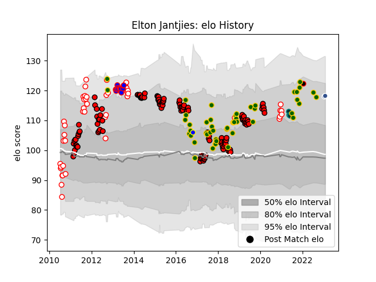

---  
layout: page  
title: Elton Jantjies  
date: 2023-01-13 11:32:37.234190  
categories: player  
---
# Elton Jantjies

## Positions: FH

## Country: South Africa

## Current elo: 118.0

## Current Percentile: 88.0

# Elo History

# Match History

| Team                            |   Appearances |   Win Rate |
|:--------------------------------|--------------:|-----------:|
| Lions                           |           131 |   0.51145  |
| South Africa                    |            49 |   0.55102  |
| Golden Lions                    |            46 |   0.608696 |
| Stormers                        |            14 |   0.5      |
| Pau                             |             3 |   0.333333 |
| Agen                            |             1 |   1        |
| NTT Docomo Red Hurricanes Osaka |             1 |   0        |
| Urayasu D-Rocks                 |             1 |   0        |

| Opponent                 |   Matches |   Win Rate |
|:-------------------------|----------:|-----------:|
| Sharks                   |        17 |   0.5      |
| Bulls                    |        14 |   0.428571 |
| Stormers                 |        12 |   0.375    |
| Cheetahs                 |        11 |   0.727273 |
| Crusaders                |        10 |   0.1      |
| Blue Bulls               |         9 |   0.444444 |
| New South Wales Waratahs |         9 |   0.555556 |
| Australia                |         8 |   0.5      |
| New Zealand              |         8 |   0.25     |
| Blues                    |         8 |   0.375    |
| Natal Sharks             |         8 |   0.5      |
| Jaguares                 |         8 |   0.75     |
| Hurricanes               |         8 |   0.125    |
| Free State Cheetahs      |         8 |   0.5625   |
| Highlanders              |         7 |   0.571429 |
| Melbourne Rebels         |         7 |   0.714286 |
| Western Province         |         7 |   0.642857 |
| Brumbies                 |         7 |   0.571429 |
| Queensland Reds          |         7 |   0.571429 |
| Griquas                  |         6 |   0.666667 |
| Argentina                |         6 |   0.833333 |
| Southern Kings           |         6 |   1        |
| Chiefs                   |         6 |   0.5      |
| Wales                    |         6 |   0.333333 |
| France                   |         5 |   1        |
| Pumas                    |         5 |   0.8      |
| Ireland                  |         4 |   0.5      |
| England                  |         4 |   0.25     |
| Sunwolves                |         4 |   1        |
| Western Force            |         4 |   0.25     |
| Leopards                 |         3 |   1        |
| Scotland                 |         2 |   1        |
| Italy                    |         2 |   0.5      |
| Racing 92                |         1 |   0        |
| Namibia                  |         1 |   1        |
| Shizuoka Blue Revs       |         1 |   0        |
| La Rochelle              |         1 |   0        |
| Georgia                  |         1 |   1        |
| Canada                   |         1 |   1        |
| Vannes                   |         1 |   1        |
| British and Irish Lions  |         1 |   0        |
| Black Rams Tokyo         |         1 |   0        |
| Agen                     |         1 |   1        |