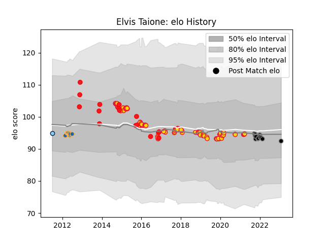

---  
layout: page  
title: Elvis Taione  
date: 2023-02-02 19:10:32.059771  
categories: player  
---
# Elvis Taione

## Positions: H

## Country: Tonga

## Current elo: 92.0

## Current Percentile: None

# Elo History

# Match History

| Team                     |   Appearances |   Win Rate |
|:-------------------------|--------------:|-----------:|
| Exeter Chiefs            |            85 |   0.617647 |
| Tonga                    |            16 |   0.4375   |
| Ospreys                  |            12 |   0.583333 |
| Western Force            |            10 |   0.2      |
| New South Wales Waratahs |             1 |   0        |

| Opponent                 |   Matches |   Win Rate |
|:-------------------------|----------:|-----------:|
| Gloucester Rugby         |        10 |   0.5      |
| Harlequins               |         9 |   0.666667 |
| Leicester Tigers         |         8 |   0.375    |
| Northampton Saints       |         6 |   0.666667 |
| Worcester Warriors       |         6 |   0.833333 |
| Sale Sharks              |         6 |   0.833333 |
| Saracens                 |         6 |   0.333333 |
| Newcastle Falcons        |         5 |   0.6      |
| Bath Rugby               |         4 |   0.5      |
| Glasgow Warriors         |         4 |   0.375    |
| London Irish             |         4 |   0.75     |
| Wasps                    |         4 |   0.75     |
| United States of America |         3 |   1        |
| Georgia                  |         3 |   0.333333 |
| Clermont Auvergne        |         2 |   0.5      |
| Brumbies                 |         2 |   0        |
| Bordeaux Begles          |         2 |   0.5      |
| Connacht                 |         2 |   0.5      |
| Italy                    |         2 |   0.5      |
| La Rochelle              |         2 |   1        |
| Ulster                   |         2 |   0.5      |
| Sharks                   |         2 |   0        |
| Dragons                  |         2 |   1        |
| Scotland                 |         2 |   0.5      |
| Stormers                 |         1 |   0        |
| Spain                    |         1 |   1        |
| Scarlets                 |         1 |   0        |
| Wales                    |         1 |   0        |
| Romania                  |         1 |   0        |
| Queensland Reds          |         1 |   1        |
| Ospreys                  |         1 |   1        |
| Argentina                |         1 |   0        |
| New Zealand              |         1 |   0        |
| New South Wales Waratahs |         1 |   0        |
| Bayonne                  |         1 |   0        |
| Benetton Treviso         |         1 |   1        |
| Blues                    |         1 |   0        |
| Bristol Rugby            |         1 |   1        |
| Cardiff Blues            |         1 |   1        |
| Cheetahs                 |         1 |   0        |
| Chiefs                   |         1 |   0        |
| Edinburgh                |         1 |   1        |
| France                   |         1 |   0        |
| Leinster                 |         1 |   0        |
| Lions                    |         1 |   1        |
| London Welsh             |         1 |   1        |
| Melbourne Rebels         |         1 |   0        |
| Montpellier Herault      |         1 |   1        |
| Munster                  |         1 |   1        |
| Zebre                    |         1 |   1        |