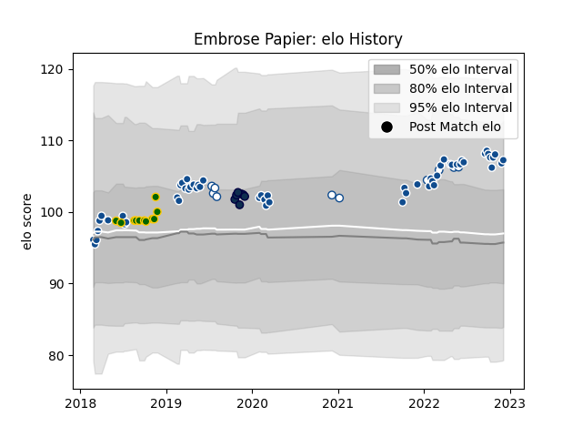

---  
layout: page  
title: Embrose Papier  
date: 2023-01-06 00:12:21.027366  
categories: player  
---
# Embrose Papier

## Positions: SH

## Country: South Africa

## Current elo: 112.0

## Current Percentile: 78.0

# Elo History

# Match History

| Team         |   Appearances |   Win Rate |
|:-------------|--------------:|-----------:|
| Bulls        |            57 |   0.5      |
| Blue Bulls   |            13 |   0.692308 |
| South Africa |            11 |   0.363636 |
| Sale Sharks  |             7 |   0.428571 |

| Opponent            |   Matches |   Win Rate |
|:--------------------|----------:|-----------:|
| Sharks              |         8 |   0.5      |
| Stormers            |         7 |   0.285714 |
| Lions               |         6 |   0.666667 |
| Jaguares            |         4 |   0.25     |
| Glasgow Warriors    |         3 |   0.333333 |
| Queensland Reds     |         3 |   0.333333 |
| Pumas               |         3 |   1        |
| Highlanders         |         3 |   0.5      |
| Griquas             |         3 |   0.666667 |
| Western Province    |         2 |   0.5      |
| Wales               |         2 |   0        |
| Ospreys             |         2 |   1        |
| Munster             |         2 |   0.5      |
| Australia           |         2 |   0.5      |
| Golden Lions        |         2 |   1        |
| Argentina           |         2 |   0.5      |
| Cardiff Blues       |         2 |   1        |
| England             |         2 |   0        |
| Benetton Treviso    |         2 |   1        |
| Edinburgh           |         2 |   0.5      |
| Crusaders           |         2 |   0        |
| Free State Cheetahs |         2 |   0.5      |
| Connacht            |         2 |   0.5      |
| Chiefs              |         2 |   0        |
| Gloucester Rugby    |         1 |   0        |
| Worcester Warriors  |         1 |   0        |
| Wasps               |         1 |   1        |
| Blues               |         1 |   0        |
| Sunwolves           |         1 |   0        |
| Bristol Rugby       |         1 |   0        |
| Brumbies            |         1 |   0        |
| Scotland            |         1 |   1        |
| New Zealand         |         1 |   0        |
| Natal Sharks        |         1 |   0        |
| Melbourne Rebels    |         1 |   1        |
| London Irish        |         1 |   1        |
| Dragons             |         1 |   1        |
| Leinster            |         1 |   1        |
| La Rochelle         |         1 |   1        |
| Hurricanes          |         1 |   1        |
| France              |         1 |   1        |
| Zebre               |         1 |   1        |