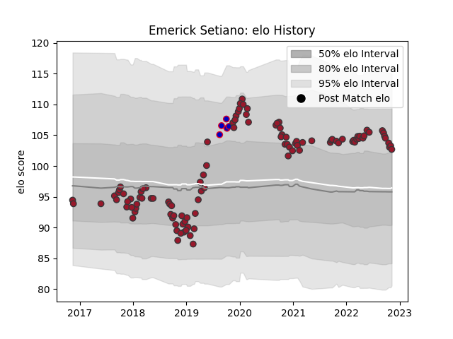

---  
layout: page  
title: Emerick Setiano  
date: 2022-12-14 11:17:49.016201  
categories: player  
---
# Emerick Setiano

## Positions: P

## Country: France

## Current elo: 102.0

## Current Percentile: 82.0

# Elo History

# Match History

| Team   |   Appearances |   Win Rate |
|:-------|--------------:|-----------:|
| Toulon |           111 |   0.563063 |
| France |             5 |   0.8      |

| Opponent                 |   Matches |   Win Rate |
|:-------------------------|----------:|-----------:|
| La Rochelle              |        11 |   0.363636 |
| Stade Toulousain         |        10 |   0.45     |
| Stade Francais Paris     |        10 |   0.8      |
| Pau                      |         8 |   0.6875   |
| Lyon                     |         7 |   0.5      |
| Bordeaux Begles          |         7 |   0.571429 |
| Clermont Auvergne        |         7 |   0.714286 |
| Racing 92                |         6 |   0.333333 |
| Castres Olympique        |         6 |   0.666667 |
| Montpellier Herault      |         6 |   0.333333 |
| Brive                    |         5 |   0.6      |
| Perpignan                |         5 |   0.6      |
| Agen                     |         4 |   0.75     |
| Bayonne                  |         4 |   0.75     |
| Scarlets                 |         3 |   0.666667 |
| Grenoble                 |         2 |   0.5      |
| Edinburgh                |         2 |   0        |
| Leicester Tigers         |         1 |   1        |
| Scotland                 |         1 |   1        |
| Wales                    |         1 |   0        |
| United States of America |         1 |   1        |
| Tonga                    |         1 |   1        |
| Benetton Treviso         |         1 |   1        |
| Bristol Rugby            |         1 |   0        |
| London Irish             |         1 |   1        |
| Oyonnax                  |         1 |   1        |
| Munster                  |         1 |   0        |
| Italy                    |         1 |   1        |
| Bath Rugby               |         1 |   0        |
| Zebre                    |         1 |   1        |