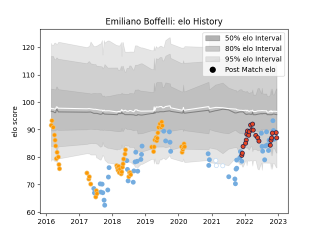

---  
layout: page  
title: Emiliano Boffelli  
date: 2022-11-16 11:25:20.555563  
categories: player  
---
# Emiliano Boffelli

## Positions: W, FB

## Country: Argentina

## Current elo: 89.0

## Current Percentile: 38.0

# Elo History

# Match History

| Team      |   Appearances |   Win Rate |
|:----------|--------------:|-----------:|
| Jaguares  |            54 |   0.5      |
| Argentina |            51 |   0.235294 |
| Edinburgh |            20 |   0.55     |
| Racing 92 |             3 |   0.666667 |

| Opponent                 |   Matches |   Win Rate |
|:-------------------------|----------:|-----------:|
| Australia                |        11 |   0.272727 |
| New Zealand              |        10 |   0.1      |
| Lions                    |         9 |   0.222222 |
| Sharks                   |         8 |   0.5      |
| South Africa             |         7 |   0.142857 |
| Scotland                 |         5 |   0.4      |
| England                  |         5 |   0.2      |
| Bulls                    |         5 |   0.6      |
| Stormers                 |         5 |   0.4      |
| Hurricanes               |         4 |   0.25     |
| Chiefs                   |         4 |   0.5      |
| Ireland                  |         3 |   0        |
| Crusaders                |         3 |   0        |
| Wales                    |         3 |   0        |
| Brumbies                 |         3 |   1        |
| Southern Kings           |         3 |   0.333333 |
| New South Wales Waratahs |         3 |   1        |
| Queensland Reds          |         3 |   0.666667 |
| France                   |         3 |   0        |
| Cardiff Blues            |         2 |   1        |
| Blues                    |         2 |   0.5      |
| Italy                    |         2 |   1        |
| Benetton Treviso         |         2 |   1        |
| Glasgow Warriors         |         2 |   0.5      |
| Melbourne Rebels         |         2 |   1        |
| Sunwolves                |         2 |   0.5      |
| Tonga                    |         1 |   1        |
| Stade Francais Paris     |         1 |   0        |
| Saracens                 |         1 |   1        |
| Ulster                   |         1 |   0        |
| Brive                    |         1 |   1        |
| Lyon                     |         1 |   1        |
| Romania                  |         1 |   1        |
| Ospreys                  |         1 |   0        |
| Munster                  |         1 |   0        |
| London Irish             |         1 |   0        |
| Leinster                 |         1 |   0        |
| Highlanders              |         1 |   0        |
| Dragons                  |         1 |   1        |
| Connacht                 |         1 |   1        |
| Cheetahs                 |         1 |   1        |
| Castres Olympique        |         1 |   1        |
| Zebre                    |         1 |   1        |