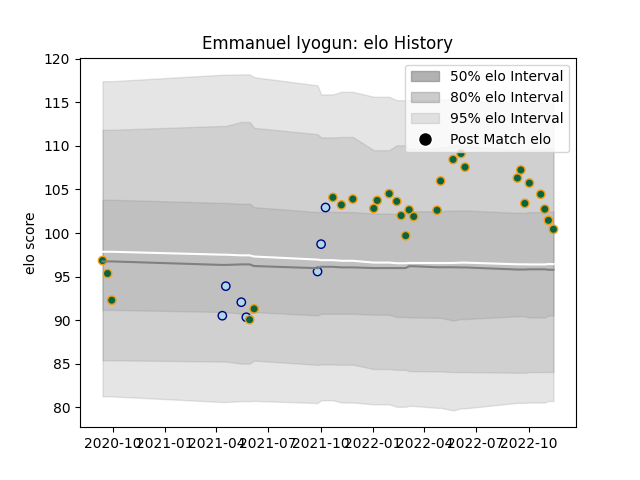

---  
layout: page  
title: Emmanuel Iyogun  
date: 2022-12-09 13:09:51.089664  
categories: player  
---
# Emmanuel Iyogun

## Positions: P

## Current elo: 103.0

## Current Percentile: 80.0

# Elo History

# Match History

| Team               |   Appearances |   Win Rate |
|:-------------------|--------------:|-----------:|
| Northampton Saints |            30 |   0.4      |
| Bedford            |             7 |   0.428571 |

| Opponent            |   Matches |   Win Rate |
|:--------------------|----------:|-----------:|
| Leicester Tigers    |         4 |       0    |
| Saracens            |         4 |       0    |
| Sale Sharks         |         4 |       0    |
| Exeter Chiefs       |         4 |       0.25 |
| Bath Rugby          |         2 |       0.5  |
| Wasps               |         2 |       1    |
| Newcastle Falcons   |         2 |       1    |
| Worcester Warriors  |         2 |       1    |
| Harlequins          |         2 |       0.5  |
| Gloucester Rugby    |         2 |       0    |
| Bristol Rugby       |         2 |       1    |
| Jersey              |         1 |       0    |
| London Irish        |         1 |       1    |
| Nottingham          |         1 |       0    |
| Richmond            |         1 |       1    |
| Ealing Trailfinders |         1 |       0    |
| Doncaster           |         1 |       1    |
| Ampthill            |         1 |       1    |