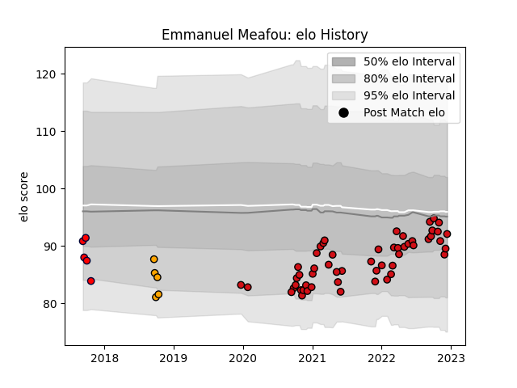

---  
layout: page  
title: Emmanuel Meafou  
date: 2022-12-09 13:12:09.616670  
categories: player  
---
# Emmanuel Meafou

## Positions: L

## Current elo: 90.0

## Current Percentile: 23.0

# Elo History

# Match History

| Team               |   Appearances |   Win Rate |
|:-------------------|--------------:|-----------:|
| Stade Toulousain   |            53 |   0.660377 |
| Melbourne Rising   |             5 |   0.2      |
| NSW Country Eagles |             5 |   0.2      |

| Opponent             |   Matches |   Win Rate |
|:---------------------|----------:|-----------:|
| Bordeaux Begles      |         6 |   0.833333 |
| La Rochelle          |         5 |   1        |
| Toulon               |         4 |   0.5      |
| Brive                |         4 |   1        |
| Stade Francais Paris |         4 |   0.375    |
| Castres Olympique    |         4 |   0.125    |
| Pau                  |         4 |   0.5      |
| Montpellier Herault  |         4 |   0.75     |
| Bayonne              |         3 |   0.333333 |
| Racing 92            |         3 |   0.666667 |
| Lyon                 |         3 |   0.333333 |
| Agen                 |         3 |   1        |
| Fijian Drua          |         2 |   0        |
| Clermont Auvergne    |         2 |   0.5      |
| Perpignan            |         2 |   1        |
| Queensland Country   |         2 |   0        |
| Sydney Rays          |         2 |   0.5      |
| Greater Sydney Rams  |         1 |   1        |
| NSW Country Eagles   |         1 |   0        |
| Cardiff Blues        |         1 |   1        |
| Canberra Vikings     |         1 |   0        |
| Brisbane City        |         1 |   0        |
| Ulster               |         1 |   1        |