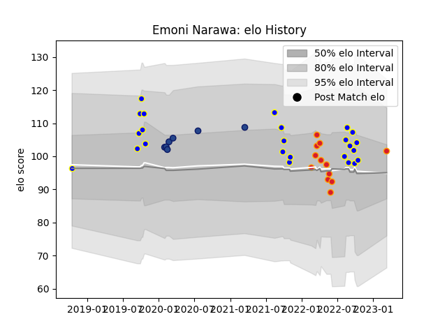

---  
layout: page  
title: Emoni Narawa  
date: 2023-03-11 00:16:08.275125  
categories: player  
---
# Emoni Narawa

## Positions: W, FB

## Current elo: 99.0

## Current Percentile: 67.0

# Elo History

# Match History

| Team          |   Appearances |   Win Rate |
|:--------------|--------------:|-----------:|
| Bay of Plenty |            24 |   0.708333 |
| Chiefs        |            11 |   0.818182 |
| Blues         |             7 |   0.571429 |

| Opponent                 |   Matches |   Win Rate |
|:-------------------------|----------:|-----------:|
| Northland                |         4 |   0.75     |
| Hawke's Bay              |         4 |   0.75     |
| Taranaki                 |         3 |   0.666667 |
| Southland                |         3 |   1        |
| Moana Pasifika           |         2 |   1        |
| Wellington               |         2 |   0.5      |
| Waikato                  |         2 |   0.5      |
| Crusaders                |         2 |   0.5      |
| Highlanders              |         2 |   1        |
| Hurricanes               |         2 |   0.5      |
| New South Wales Waratahs |         2 |   1        |
| Manawatu                 |         2 |   1        |
| Auckland                 |         1 |   1        |
| Otago                    |         1 |   1        |
| Lions                    |         1 |   1        |
| Melbourne Rebels         |         1 |   1        |
| Blues                    |         1 |   0        |
| Fijian Drua              |         1 |   1        |
| Counties Manukau         |         1 |   0        |
| Chiefs                   |         1 |   0        |
| Canterbury               |         1 |   0        |
| Bulls                    |         1 |   1        |
| Brumbies                 |         1 |   0        |
| Western Force            |         1 |   1        |