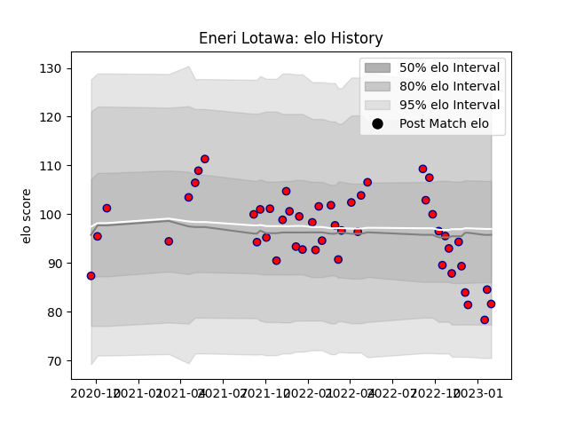

---  
layout: page  
title: Eneri Lotawa  
date: 2023-02-02 18:45:46.195745  
categories: player  
---
# Eneri Lotawa

## Positions: W, C

## Current elo: 82.0

## Current Percentile: 21.0

# Elo History

# Match History

| Team                       |   Appearances |   Win Rate |
|:---------------------------|--------------:|-----------:|
| Cognac Saint Jean d'Angély |            48 |   0.260417 |

| Opponent                   |   Matches |   Win Rate |
|:---------------------------|----------:|-----------:|
| Tarbes                     |         6 |  0.0833333 |
| Albi                       |         4 |  0         |
| Chambery                   |         4 |  0.25      |
| Dax                        |         4 |  0.75      |
| Aubenas                    |         3 |  0.333333  |
| Suresnes                   |         3 |  0         |
| Nice                       |         3 |  0.333333  |
| Valence Romans Drome Rugby |         3 |  0         |
| Dijon                      |         3 |  1         |
| Bourgoin-Jallieu           |         3 |  0.333333  |
| Blagnac                    |         3 |  0.666667  |
| Narbonne                   |         2 |  0         |
| Soyaux-Angouleme           |         2 |  0         |
| US Bressane                |         2 |  0         |
| Carqueiranne-Hyères        |         1 |  0         |
| Rennes                     |         1 |  0         |
| Massy                      |         1 |  0         |