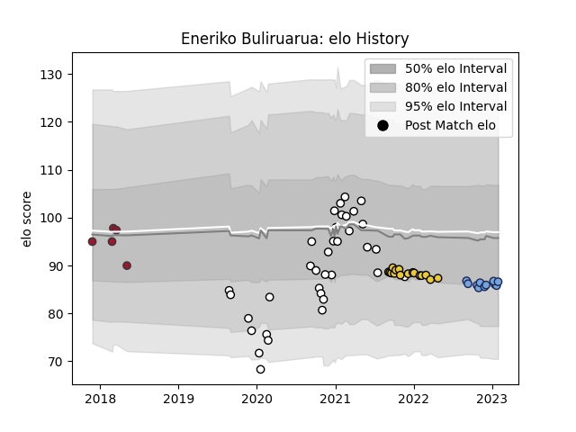

---  
layout: page  
title: Eneriko Buliruarua  
date: 2022-12-12 14:57:36.490499  
categories: player  
---
# Eneriko Buliruarua

## Positions: C, W

## Country: Fiji

## Current elo: 89.0

## Current Percentile: 21.0

# Elo History

# Match History

| Team        |   Appearances |   Win Rate |
|:------------|--------------:|-----------:|
| Brive       |            31 |   0.354839 |
| La Rochelle |            16 |   0.375    |
| Bayonne     |             7 |   0.714286 |
| Toulon      |             5 |   0.2      |
| Fiji        |             3 |   0.166667 |

| Opponent             |   Matches |   Win Rate |
|:---------------------|----------:|-----------:|
| Toulon               |         6 |   0.333333 |
| Lyon                 |         5 |   0.8      |
| Montpellier Herault  |         5 |   0.2      |
| Castres Olympique    |         5 |   0.4      |
| Pau                  |         5 |   0.6      |
| Stade Toulousain     |         4 |   0.25     |
| Stade Francais Paris |         4 |   0.25     |
| Clermont Auvergne    |         4 |   0.25     |
| Racing 92            |         3 |   0.333333 |
| Perpignan            |         3 |   0.666667 |
| New Zealand          |         2 |   0        |
| Agen                 |         2 |   0.5      |
| Bayonne              |         2 |   0.5      |
| La Rochelle          |         2 |   0.5      |
| Bristol Rugby        |         2 |   0        |
| Bordeaux Begles      |         2 |   0.5      |
| Biarritz Olympique   |         2 |   0.5      |
| Oyonnax              |         1 |   0        |
| Leicester Tigers     |         1 |   0        |
| Georgia              |         1 |   0.5      |
| Zebre                |         1 |   0        |