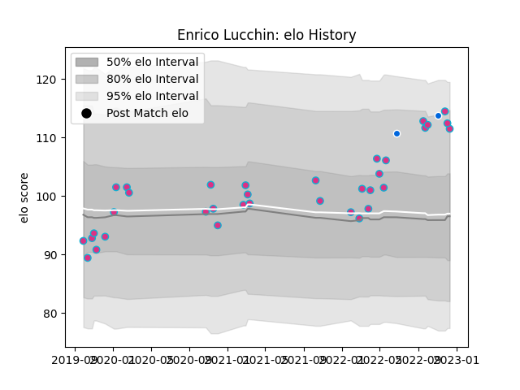

---  
layout: page  
title: Enrico Lucchin  
date: 2022-12-14 11:24:52.482229  
categories: player  
---
# Enrico Lucchin

## Positions: C

## Country: Italy

## Current elo: 112.0

## Current Percentile: 87.0

# Elo History

# Match History

| Team   |   Appearances |   Win Rate |
|:-------|--------------:|-----------:|
| Zebre  |            35 |   0.142857 |
| Italy  |             2 |   1        |

| Opponent             |   Matches |   Win Rate |
|:---------------------|----------:|-----------:|
| Leinster             |         5 |          0 |
| Glasgow Warriors     |         5 |          0 |
| Munster              |         4 |          0 |
| Edinburgh            |         3 |          0 |
| Scarlets             |         3 |          0 |
| Ulster               |         3 |          0 |
| Dragons              |         2 |          1 |
| Ospreys              |         2 |          0 |
| Connacht             |         1 |          0 |
| Cheetahs             |         1 |          1 |
| Brive                |         1 |          1 |
| Namibia              |         1 |          1 |
| Samoa                |         1 |          1 |
| Bulls                |         1 |          0 |
| Sharks               |         1 |          0 |
| Stade Francais Paris |         1 |          1 |
| Toulon               |         1 |          0 |
| Benetton Treviso     |         1 |          0 |