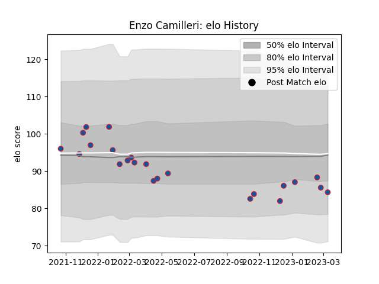

---  
layout: page  
title: Enzo Camilleri  
date: 2022-12-14 11:36:54.114054  
categories: player  
---
# Enzo Camilleri

## Positions: H

## Current elo: 88.0

## Current Percentile: 23.0

# Elo History

# Match History

| Team     |   Appearances |   Win Rate |
|:---------|--------------:|-----------:|
| Grenoble |             9 |   0.333333 |

| Opponent       |   Matches |   Win Rate |
|:---------------|----------:|-----------:|
| Montauban      |         2 |       0.75 |
| Agen           |         1 |       0    |
| Bayonne        |         1 |       1    |
| Mont-de-Marsan |         1 |       0    |
| Narbonne       |         1 |       0.5  |
| Provence Rugby |         1 |       0    |
| Rouen          |         1 |       0    |
| US Bressane    |         1 |       0    |