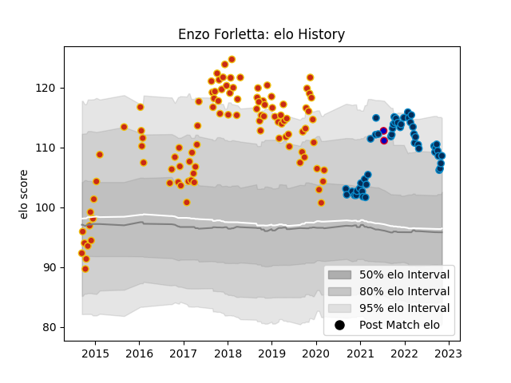

---  
layout: page  
title: Enzo Forletta  
date: 2022-12-14 11:14:20.041623  
categories: player  
---
# Enzo Forletta

## Positions: P

## Country: France

## Current elo: 109.0

## Current Percentile: 87.0

# Elo History

# Match History

| Team                |   Appearances |   Win Rate |
|:--------------------|--------------:|-----------:|
| Perpignan           |           100 |   0.52     |
| Montpellier Herault |            51 |   0.578431 |
| France              |             2 |   0.5      |

| Opponent             |   Matches |   Win Rate |
|:---------------------|----------:|-----------:|
| Pau                  |         7 |   0.285714 |
| Lyon                 |         7 |   0.142857 |
| La Rochelle          |         7 |   0.428571 |
| Carcassonne          |         7 |   0.714286 |
| Biarritz Olympique   |         7 |   0.714286 |
| Grenoble             |         6 |   0.666667 |
| Castres Olympique    |         6 |   0.166667 |
| Agen                 |         6 |   0.5      |
| Bordeaux Begles      |         6 |   0.25     |
| Stade Francais Paris |         6 |   0.666667 |
| Stade Toulousain     |         6 |   0.166667 |
| Clermont Auvergne    |         5 |   0.4      |
| Narbonne             |         5 |   1        |
| Montauban            |         5 |   0.6      |
| Toulon               |         5 |   0.6      |
| Racing 92            |         4 |   0.25     |
| Soyaux-Angouleme     |         4 |   1        |
| Mont-de-Marsan       |         4 |   0.5      |
| Vannes               |         4 |   0.75     |
| Bourgoin-Jallieu     |         4 |   1        |
| Aurillac             |         4 |   0.625    |
| Colomiers            |         4 |   0.5      |
| Bayonne              |         4 |   0.75     |
| Brive                |         4 |   0.875    |
| Beziers              |         4 |   0.75     |
| Dax                  |         3 |   0.333333 |
| Albi                 |         2 |   0.5      |
| Australia            |         2 |   0.5      |
| Rouen                |         2 |   0.5      |
| Massy                |         2 |   0.5      |
| Perpignan            |         2 |   1        |
| Oyonnax              |         2 |   0        |
| Nevers               |         2 |   0.5      |
| London Irish         |         1 |   1        |
| Roval Drome XV       |         1 |   1        |
| Tarbes               |         1 |   1        |
| Montpellier Herault  |         1 |   0        |
| Provence Rugby       |         1 |   0        |