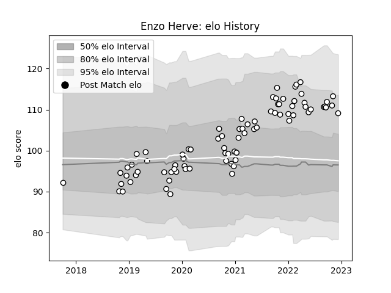

---  
layout: page  
title: Enzo Herve  
date: 2023-01-06 00:20:06.655222  
categories: player  
---
# Enzo Herve

## Positions: FH

## Current elo: 126.0

## Current Percentile: 92.0

# Elo History

# Match History

| Team   |   Appearances |   Win Rate |
|:-------|--------------:|-----------:|
| Brive  |            87 |   0.465517 |

| Opponent             |   Matches |   Win Rate |
|:---------------------|----------:|-----------:|
| Lyon                 |         7 |   0.428571 |
| Castres Olympique    |         6 |   0.333333 |
| Montpellier Herault  |         6 |   0.25     |
| Pau                  |         6 |   0.666667 |
| Toulon               |         5 |   0.6      |
| Stade Toulousain     |         5 |   0.2      |
| Stade Francais Paris |         5 |   0.8      |
| Racing 92            |         4 |   0.25     |
| La Rochelle          |         4 |   0.25     |
| Agen                 |         4 |   0.5      |
| Clermont Auvergne    |         4 |   0.5      |
| Bordeaux Begles      |         4 |   0.5      |
| Biarritz Olympique   |         3 |   0.666667 |
| Bayonne              |         3 |   0.666667 |
| Perpignan            |         3 |   0.666667 |
| Provence Rugby       |         2 |   0.5      |
| US Bressane          |         2 |   0.5      |
| Montauban            |         2 |   0.5      |
| Oyonnax              |         2 |   1        |
| Bristol Rugby        |         2 |   0        |
| Nevers               |         1 |   1        |
| Leicester Tigers     |         1 |   0        |
| Colomiers            |         1 |   0        |
| Soyaux-Angouleme     |         1 |   1        |
| Cardiff Blues        |         1 |   0        |
| Carcassonne          |         1 |   0        |
| Beziers              |         1 |   0        |
| Vannes               |         1 |   1        |