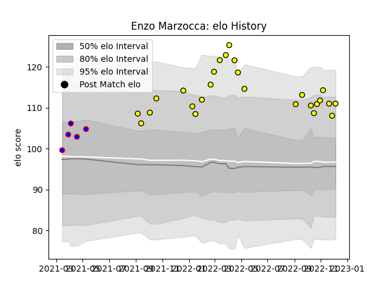

---  
layout: page  
title: Enzo Marzocca  
date: 2022-11-22 11:35:49.417535  
categories: player  
---
# Enzo Marzocca

## Positions: FB, W

## Current elo: 110.0

## Current Percentile: 91.0

# Elo History

# Match History

| Team   |   Appearances |   Win Rate |
|:-------|--------------:|-----------:|
| Albi   |            24 |     0.6875 |
| Dijon  |             5 |     0.7    |

| Opponent                   |   Matches |   Win Rate |
|:---------------------------|----------:|-----------:|
| Tarbes                     |         4 |   0.5      |
| Blagnac                    |         3 |   0.666667 |
| Massy                      |         3 |   0.666667 |
| Aubenas                    |         2 |   0.75     |
| Bourgoin-Jallieu           |         2 |   1        |
| Chambery                   |         2 |   1        |
| Cognac Saint Jean d'Angély |         2 |   1        |
| Dax                        |         2 |   1        |
| Dijon                      |         2 |   1        |
| Valence Romans Drome Rugby |         2 |   1        |
| Albi                       |         1 |   0        |
| Carqueiranne-Hyères        |         1 |   0        |
| Nice                       |         1 |   0.5      |
| Soyaux-Angouleme           |         1 |   0        |
| Suresnes                   |         1 |   0        |