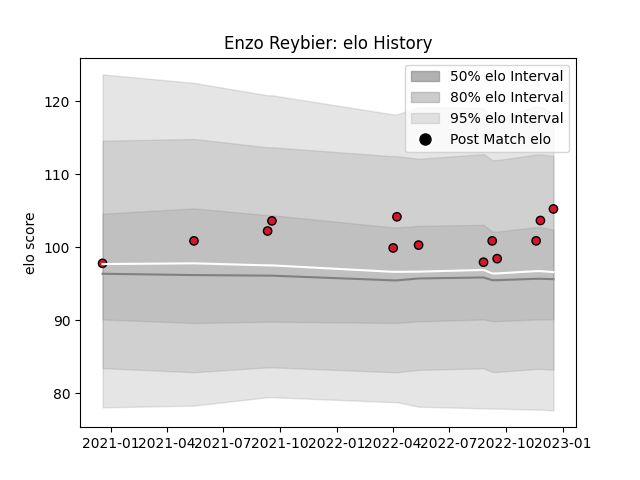

---  
layout: page  
title: Enzo Reybier  
date: 2022-12-18 16:17:04.826964  
categories: player  
---
# Enzo Reybier

## Positions: W

## Current elo: 105.0

## Current Percentile: 78.0

# Elo History

# Match History

| Team    |   Appearances |   Win Rate |
|:--------|--------------:|-----------:|
| Oyonnax |            13 |   0.576923 |

| Opponent                   |   Matches |   Win Rate |
|:---------------------------|----------:|-----------:|
| Aurillac                   |         2 |        0.5 |
| Agen                       |         1 |        1   |
| Beziers                    |         1 |        0.5 |
| Biarritz Olympique         |         1 |        0   |
| Carcassonne                |         1 |        1   |
| Colomiers                  |         1 |        1   |
| Grenoble                   |         1 |        1   |
| Mont-de-Marsan             |         1 |        0   |
| Nevers                     |         1 |        0   |
| Perpignan                  |         1 |        0   |
| US Bressane                |         1 |        1   |
| Valence Romans Drome Rugby |         1 |        1   |