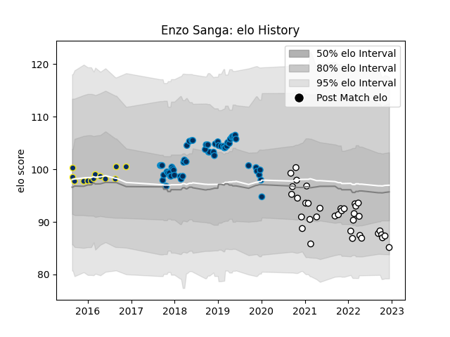

---  
layout: page  
title: Enzo Sanga  
date: 2022-12-18 16:21:14.035317  
categories: player  
---
# Enzo Sanga

## Positions: SH

## Current elo: 84.0

## Current Percentile: 12.0

# Elo History

# Match History

| Team                       |   Appearances |   Win Rate |
|:---------------------------|--------------:|-----------:|
| Montpellier Herault        |            55 |   0.572727 |
| Brive                      |            22 |   0.25     |
| Valence Romans Drome Rugby |            15 |   0.466667 |
| Clermont Auvergne          |            13 |   0.692308 |

| Opponent             |   Matches |   Win Rate |
|:---------------------|----------:|-----------:|
| Toulon               |         9 |   0.444444 |
| Castres Olympique    |         8 |   0.625    |
| Stade Toulousain     |         8 |   0.25     |
| Lyon                 |         8 |   0.375    |
| La Rochelle          |         7 |   0.357143 |
| Racing 92            |         6 |   0.333333 |
| Agen                 |         5 |   0.8      |
| Clermont Auvergne    |         5 |   0.6      |
| Montpellier Herault  |         4 |   0.375    |
| Grenoble             |         4 |   0.75     |
| Bordeaux Begles      |         4 |   0.625    |
| Brive                |         3 |   0.666667 |
| Perpignan            |         3 |   0.333333 |
| Pau                  |         3 |   1        |
| Oyonnax              |         3 |   0.666667 |
| Stade Francais Paris |         2 |   0.75     |
| Rouen                |         2 |   0.5      |
| Nevers               |         2 |   0.5      |
| Carcassonne          |         2 |   1        |
| Beziers              |         2 |   0.25     |
| Glasgow Warriors     |         2 |   1        |
| Edinburgh            |         2 |   0.5      |
| Connacht             |         2 |   0        |
| Cardiff Blues        |         1 |   0        |
| Newcastle Falcons    |         1 |   0        |
| Gloucester Rugby     |         1 |   1        |
| Exeter Chiefs        |         1 |   0        |
| Saracens             |         1 |   0        |
| Soyaux-Angouleme     |         1 |   0.5      |
| Colomiers            |         1 |   1        |
| Biarritz Olympique   |         1 |   1        |
| Mont-de-Marsan       |         1 |   0        |