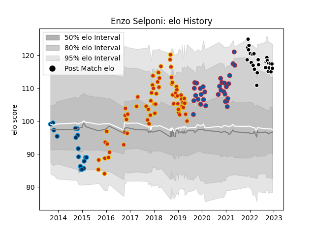

---  
layout: page  
title: Enzo Selponi  
date: 2023-02-02 18:58:42.722355  
categories: player  
---
# Enzo Selponi

## Positions: FH

## Current elo: 119.0

## Current Percentile: 91.0

# Elo History

# Match History

| Team                |   Appearances |   Win Rate |
|:--------------------|--------------:|-----------:|
| Perpignan           |            88 |   0.443182 |
| Grenoble            |            44 |   0.556818 |
| Provence Rugby      |            36 |   0.555556 |
| Montpellier Herault |            20 |   0.375    |

| Opponent                   |   Matches |   Win Rate |
|:---------------------------|----------:|-----------:|
| Beziers                    |        12 |   0.583333 |
| Colomiers                  |         9 |   0.333333 |
| Aurillac                   |         9 |   0.666667 |
| Soyaux-Angouleme           |         9 |   0.777778 |
| Oyonnax                    |         9 |   0.611111 |
| Mont-de-Marsan             |         9 |   0.555556 |
| Grenoble                   |         9 |   0.722222 |
| Vannes                     |         8 |   0.375    |
| Biarritz Olympique         |         8 |   0.3125   |
| Carcassonne                |         8 |   0.75     |
| Narbonne                   |         7 |   0.714286 |
| Montauban                  |         7 |   0.571429 |
| Agen                       |         6 |   0.166667 |
| Bordeaux Begles            |         5 |   0.4      |
| Nevers                     |         5 |   0.6      |
| Bayonne                    |         4 |   0.5      |
| Stade Toulousain           |         4 |   0.5      |
| Dax                        |         4 |   0.5      |
| Rouen                      |         4 |   0.5      |
| La Rochelle                |         4 |   0.125    |
| Provence Rugby             |         4 |   0.75     |
| Perpignan                  |         4 |   0.25     |
| Stade Francais Paris       |         3 |   0.333333 |
| Castres Olympique          |         3 |   0        |
| Lyon                       |         3 |   0.333333 |
| Massy                      |         3 |   0.333333 |
| Montpellier Herault        |         2 |   0.5      |
| Connacht                   |         2 |   0        |
| Bourgoin-Jallieu           |         2 |   1        |
| Pau                        |         2 |   0        |
| Albi                       |         2 |   0.5      |
| Valence Romans Drome Rugby |         2 |   1        |
| Racing 92                  |         2 |   0        |
| Toulon                     |         2 |   0        |
| Sale Sharks                |         2 |   0        |
| Bath Rugby                 |         2 |   0        |
| Glasgow Warriors           |         2 |   0        |
| Tarbes                     |         1 |   1        |
| Roval Drome XV             |         1 |   1        |
| Benetton Treviso           |         1 |   1        |
| Brive                      |         1 |   0        |
| Leicester Tigers           |         1 |   0        |
| Clermont Auvergne          |         1 |   0        |