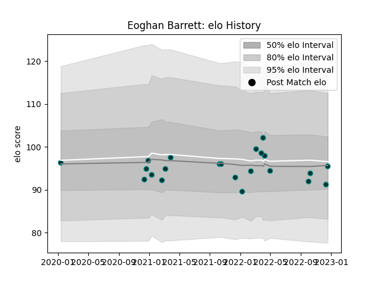

---  
layout: page  
title: Eoghan Barrett  
date: 2022-12-14 11:23:50.182399  
categories: player  
---
# Eoghan Barrett

## Positions: W

## Current elo: 91.0

## Current Percentile: 41.0

# Elo History

# Match History

| Team   |   Appearances |   Win Rate |
|:-------|--------------:|-----------:|
| Pau    |            21 |   0.285714 |

| Opponent             |   Matches |   Win Rate |
|:---------------------|----------:|-----------:|
| Bordeaux Begles      |         3 |   0.333333 |
| Racing 92            |         3 |   0        |
| London Irish         |         2 |   0        |
| Toulon               |         2 |   0        |
| Biarritz Olympique   |         1 |   1        |
| Calvisano            |         1 |   1        |
| Castres Olympique    |         1 |   0        |
| Cheetahs             |         1 |   0        |
| Clermont Auvergne    |         1 |   0        |
| Edinburgh            |         1 |   0        |
| Lyon                 |         1 |   0        |
| Perpignan            |         1 |   1        |
| Stade Francais Paris |         1 |   1        |
| Stade Toulousain     |         1 |   0        |
| Worcester Warriors   |         1 |   1        |