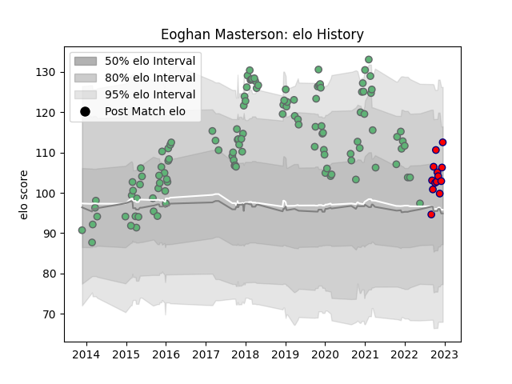

---  
layout: page  
title: Eoghan Masterson  
date: 2023-03-17 17:37:18.983319  
categories: player  
---
# Eoghan Masterson

## Positions: FL, N8

## Current elo: 112.0

## Current Percentile: 73.0

# Elo History

# Match History

| Team     |   Appearances |   Win Rate |
|:---------|--------------:|-----------:|
| Connacht |           118 |   0.495763 |
| Aurillac |            13 |   0.692308 |

| Opponent               |   Matches |   Win Rate |
|:-----------------------|----------:|-----------:|
| Ulster                 |        11 |   0.272727 |
| Zebre                  |        10 |   0.7      |
| Scarlets               |        10 |   0.2      |
| Munster                |        10 |   0.3      |
| Benetton Treviso       |         8 |   1        |
| Leinster               |         8 |   0.25     |
| Dragons                |         7 |   0.857143 |
| Cardiff Blues          |         5 |   0.2      |
| Edinburgh              |         5 |   0.4      |
| Glasgow Warriors       |         5 |   0        |
| Gloucester Rugby       |         5 |   0.2      |
| Ospreys                |         5 |   0.8      |
| Brive                  |         4 |   0.75     |
| Southern Kings         |         3 |   1        |
| Cheetahs               |         3 |   0.666667 |
| Sale Sharks            |         2 |   0.5      |
| Perpignan              |         2 |   1        |
| Oyonnax                |         2 |   1        |
| Worcester Warriors     |         2 |   0.75     |
| Montpellier Herault    |         2 |   0.5      |
| Montauban              |         1 |   1        |
| Massy                  |         1 |   1        |
| Beziers                |         1 |   1        |
| Vannes                 |         1 |   1        |
| Biarritz Olympique     |         1 |   0        |
| Stade Toulousain       |         1 |   0        |
| Stade Francais Paris   |         1 |   1        |
| Soyaux-Angouleme       |         1 |   1        |
| Bordeaux Begles        |         1 |   1        |
| Bristol Rugby          |         1 |   0        |
| Carcassonne            |         1 |   0        |
| Rouen                  |         1 |   1        |
| Racing 92              |         1 |   0        |
| RC Enisei              |         1 |   1        |
| Provence Rugby         |         1 |   1        |
| Colomiers              |         1 |   1        |
| Enisey-STM Krasnoyarsk |         1 |   1        |
| Grenoble               |         1 |   0        |
| Newcastle Falcons      |         1 |   0        |
| Nevers                 |         1 |   1        |
| Leicester Tigers       |         1 |   0        |
| Agen                   |         1 |   0        |