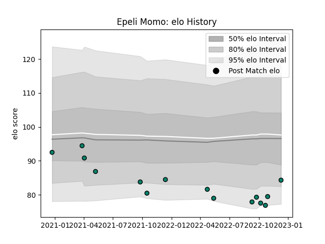

---  
layout: page  
title: Epeli Momo  
date: 2022-12-18 16:16:50.208091  
categories: player  
---
# Epeli Momo

## Positions: W

## Current elo: 84.0

## Current Percentile: 6.0

# Elo History

# Match History

| Team      |   Appearances |   Win Rate |
|:----------|--------------:|-----------:|
| Montauban |            15 |   0.133333 |

| Opponent                   |   Matches |   Win Rate |
|:---------------------------|----------:|-----------:|
| Nevers                     |         2 |          0 |
| Oyonnax                    |         2 |          0 |
| Provence Rugby             |         2 |          0 |
| Agen                       |         1 |          1 |
| Aurillac                   |         1 |          0 |
| Bayonne                    |         1 |          0 |
| Biarritz Olympique         |         1 |          0 |
| Carcassonne                |         1 |          0 |
| Colomiers                  |         1 |          0 |
| Grenoble                   |         1 |          0 |
| Mont-de-Marsan             |         1 |          1 |
| Valence Romans Drome Rugby |         1 |          0 |