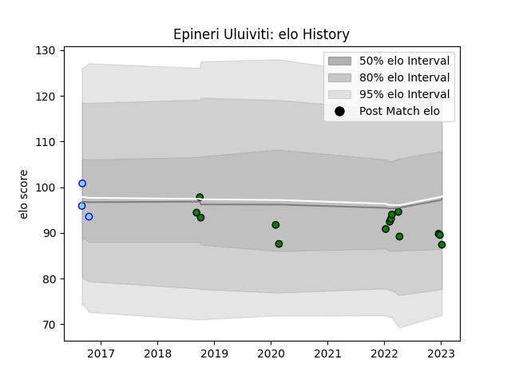

---  
layout: page  
title: Epineri Uluiviti  
date: 2023-02-02 19:09:18.419401  
categories: player  
---
# Epineri Uluiviti

## Positions: L

## Current elo: 85.0

## Current Percentile: 27.0

# Elo History

# Match History

| Team                 |   Appearances |   Win Rate |
|:---------------------|--------------:|-----------:|
| Mitsubishi Dynaboars |            15 |   0.666667 |
| Northland            |             3 |   0        |

| Opponent                  |   Matches |   Win Rate |
|:--------------------------|----------:|-----------:|
| Kamaishi Seawaves         |         2 |        1   |
| Mie Honda Heat            |         2 |        0.5 |
| Black Rams Tokyo          |         1 |        1   |
| Canterbury                |         1 |        0   |
| Chugoku Red Regulions     |         1 |        1   |
| Hanazono Kintetsu Liners  |         1 |        1   |
| Hino Red Dolphins         |         1 |        1   |
| Mazda Blue Zoomers        |         1 |        1   |
| North Harbour             |         1 |        0   |
| Otago                     |         1 |        0   |
| Saitama Wild Knights      |         1 |        0   |
| Shizuoka Blue Revs        |         1 |        0   |
| Skyactivs Hiroshima       |         1 |        1   |
| Tokyo Sungoliath          |         1 |        0   |
| Toshiba Brave Lupus Tokyo |         1 |        0   |
| Toyota Verblitz           |         1 |        1   |