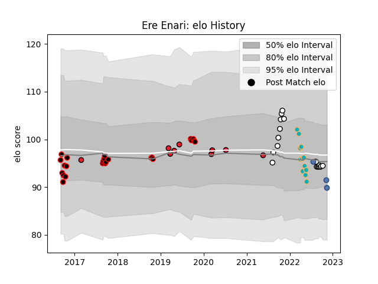

---  
layout: page  
title: Ere Enari  
date: 2023-03-02 11:24:46.488791  
categories: player  
---
# Ere Enari

## Positions: SH

## Country: Samoa

## Current elo: 102.0

## Current Percentile: 72.0

# Elo History

# Match History

| Team           |   Appearances |   Win Rate |
|:---------------|--------------:|-----------:|
| Canterbury     |            24 |   0.75     |
| Hawke's Bay    |            18 |   0.583333 |
| Moana Pasifika |            14 |   0        |
| Crusaders      |             9 |   0.888889 |
| Samoa          |             3 |   0.666667 |

| Opponent                 |   Matches |   Win Rate |
|:-------------------------|----------:|-----------:|
| Otago                    |         5 |   0.8      |
| Chiefs                   |         5 |   0.2      |
| Counties Manukau         |         5 |   0.8      |
| Wellington               |         5 |   0.2      |
| North Harbour            |         4 |   1        |
| Tasman                   |         4 |   0.75     |
| Waikato                  |         3 |   0.833333 |
| Manawatu                 |         3 |   0.333333 |
| Auckland                 |         2 |   0.5      |
| Bay of Plenty            |         2 |   0.5      |
| Queensland Reds          |         2 |   0.5      |
| Northland                |         2 |   1        |
| New South Wales Waratahs |         2 |   0        |
| Melbourne Rebels         |         2 |   0.5      |
| Hawke's Bay              |         2 |   1        |
| Highlanders              |         2 |   0.5      |
| Fijian Drua              |         2 |   0        |
| Canterbury               |         2 |   0.5      |
| Brumbies                 |         2 |   1        |
| Blues                    |         2 |   0        |
| Southland                |         2 |   1        |
| Taranaki                 |         1 |   0        |
| Sunwolves                |         1 |   1        |
| Lions                    |         1 |   1        |
| Italy                    |         1 |   0        |
| Georgia                  |         1 |   1        |
| Fiji                     |         1 |   1        |
| Crusaders                |         1 |   0        |
| Western Force            |         1 |   0        |