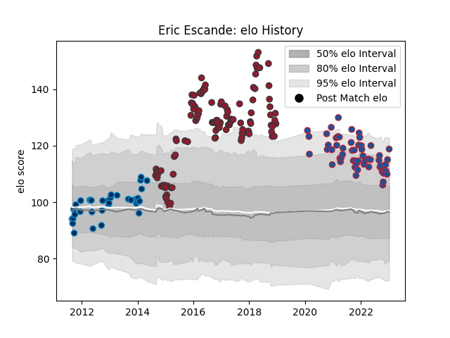

---  
layout: page  
title: Eric Escande  
date: 2022-11-22 11:35:10.854413  
categories: player  
---
# Eric Escande

## Positions: SH

## Current elo: 98.0

## Current Percentile: 52.0

# Elo History

# Match History

| Team                |   Appearances |   Win Rate |
|:--------------------|--------------:|-----------:|
| Toulon              |           118 |   0.614407 |
| Grenoble            |            39 |   0.564103 |
| Montpellier Herault |            27 |   0.518519 |

| Opponent                   |   Matches |   Win Rate |
|:---------------------------|----------:|-----------:|
| Clermont Auvergne          |        12 |   0.333333 |
| Bordeaux Begles            |        12 |   0.583333 |
| Montpellier Herault        |        10 |   0.4      |
| Castres Olympique          |        10 |   0.7      |
| Stade Toulousain           |         9 |   0.444444 |
| Stade Francais Paris       |         9 |   0.5      |
| La Rochelle                |         9 |   0.611111 |
| Oyonnax                    |         8 |   0.625    |
| Racing 92                  |         7 |   0.428571 |
| Brive                      |         7 |   0.428571 |
| Lyon                       |         6 |   0.75     |
| Grenoble                   |         6 |   0.916667 |
| Agen                       |         6 |   0.833333 |
| Pau                        |         5 |   1        |
| Scarlets                   |         5 |   0.6      |
| Bayonne                    |         4 |   0.75     |
| Perpignan                  |         4 |   0.25     |
| Mont-de-Marsan             |         3 |   1        |
| Vannes                     |         3 |   0.666667 |
| Bath Rugby                 |         3 |   0.666667 |
| Provence Rugby             |         3 |   0        |
| Colomiers                  |         3 |   0.333333 |
| Leicester Tigers           |         3 |   0        |
| Biarritz Olympique         |         3 |   0.5      |
| Montauban                  |         2 |   0.75     |
| Benetton Treviso           |         2 |   1        |
| Glasgow Warriors           |         2 |   0.25     |
| Toulon                     |         2 |   1        |
| Cardiff Blues              |         2 |   1        |
| Carcassonne                |         2 |   0.5      |
| Soyaux-Angouleme           |         2 |   0.5      |
| Rouen                      |         2 |   1        |
| Sale Sharks                |         2 |   1        |
| Leinster                   |         2 |   1        |
| Beziers                    |         2 |   0.5      |
| Nevers                     |         2 |   1        |
| Aurillac                   |         1 |   1        |
| Saracens                   |         1 |   0        |
| Edinburgh                  |         1 |   0        |
| Newcastle Falcons          |         1 |   0        |
| Narbonne                   |         1 |   1        |
| US Bressane                |         1 |   1        |
| Ulster                     |         1 |   1        |
| Valence Romans Drome Rugby |         1 |   1        |
| Munster                    |         1 |   0        |
| Wasps                      |         1 |   1        |