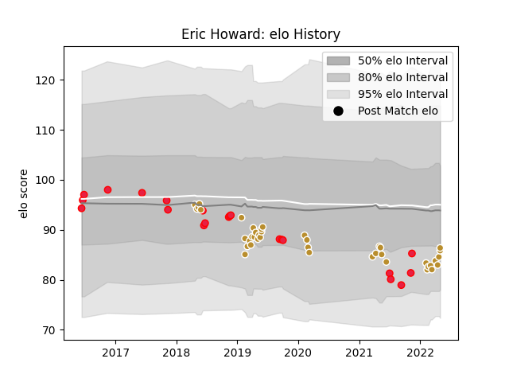

---  
layout: page  
title: Eric Howard  
date: 2023-03-21 18:45:11.149182  
categories: player  
---
# Eric Howard

Last updated: 2023-03-21
## Positions: H

## Country: Canada

## Current elo: 86.0

## Current Percentile: 20.0

# Elo History

# Match History

| Team      |   Appearances |   Win Rate |
|:----------|--------------:|-----------:|
| NOLA Gold |            41 |   0.426829 |
| Canada    |            21 |   0.238095 |

| Opponent                 |   Matches |   Win Rate |
|:-------------------------|----------:|-----------:|
| Houston SaberCats        |         5 |   0.8      |
| Toronto Arrows           |         5 |   0.6      |
| Seattle Seawolves        |         4 |   0.25     |
| San Diego Legion         |         4 |   0        |
| Austin Elite Rugby       |         3 |   0.666667 |
| United States of America |         3 |   0        |
| Rugby New York           |         3 |   0        |
| R.U. New York            |         3 |   0        |
| Old Glory DC             |         3 |   0.833333 |
| New England Free Jacks   |         3 |   0.333333 |
| Georgia                  |         2 |   0        |
| Italy                    |         2 |   0        |
| Utah Warriors            |         2 |   1        |
| Austin Gilgronis         |         2 |   0        |
| Russia                   |         2 |   0.5      |
| Hong Kong                |         1 |   1        |
| Belgium                  |         1 |   1        |
| Colorado Raptors         |         1 |   1        |
| Dallas Jackals           |         1 |   1        |
| Scotland                 |         1 |   0        |
| England                  |         1 |   0        |
| Germany                  |         1 |   1        |
| Rugby ATL                |         1 |   0        |
| Ireland                  |         1 |   0        |
| Portugal                 |         1 |   0        |
| Glendale Raptors         |         1 |   0        |
| New Zealand Maori        |         1 |   0        |
| New Zealand              |         1 |   0        |
| Kenya                    |         1 |   1        |
| Japan                    |         1 |   0        |
| Wales                    |         1 |   0        |