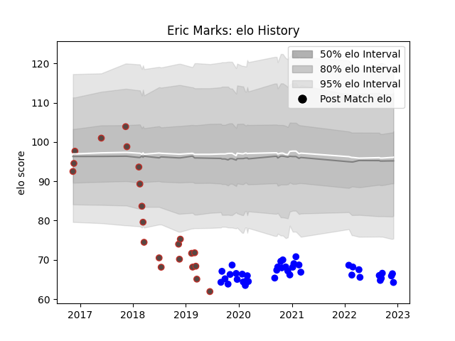

---  
layout: page  
title: Eric Marks  
date: 2023-02-02 19:06:46.995471  
categories: player  
---
# Eric Marks

## Positions: L, FL

## Country: Germany

## Current elo: 44.0

## Current Percentile: 0.0

# Elo History

# Match History

| Team    |   Appearances |   Win Rate |
|:--------|--------------:|-----------:|
| Vannes  |            64 |   0.570312 |
| Germany |            22 |   0.318182 |

| Opponent                   |   Matches |   Win Rate |
|:---------------------------|----------:|-----------:|
| Provence Rugby             |         6 |   0.5      |
| Aurillac                   |         5 |   0.6      |
| Beziers                    |         5 |   0.8      |
| Biarritz Olympique         |         5 |   0.4      |
| Soyaux-Angouleme           |         5 |   0.6      |
| Montauban                  |         5 |   0.7      |
| Mont-de-Marsan             |         5 |   0.8      |
| Nevers                     |         4 |   0.375    |
| Colomiers                  |         4 |   0.5      |
| Rouen                      |         3 |   0.333333 |
| Brazil                     |         3 |   1        |
| Carcassonne                |         3 |   0.5      |
| Grenoble                   |         3 |   1        |
| Samoa                      |         2 |   0        |
| Roval Drome XV             |         2 |   1        |
| Russia                     |         2 |   0        |
| Spain                      |         2 |   0        |
| Romania                    |         2 |   0        |
| Agen                       |         2 |   0        |
| Perpignan                  |         2 |   0        |
| Oyonnax                    |         2 |   0.5      |
| Kenya                      |         2 |   1        |
| Georgia                    |         2 |   0        |
| Belgium                    |         2 |   0        |
| Portugal                   |         1 |   0        |
| Massy                      |         1 |   0        |
| Hong Kong                  |         1 |   1        |
| Canada                     |         1 |   0        |
| US Bressane                |         1 |   1        |
| United States of America   |         1 |   0        |
| Uruguay                    |         1 |   1        |
| Valence Romans Drome Rugby |         1 |   1        |