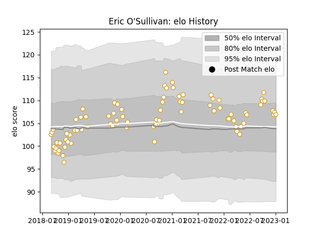

---  
layout: page  
title: Eric O'Sullivan  
date: 2023-01-06 00:21:35.896922  
categories: player  
---
# Eric O'Sullivan

## Positions: P

## Current elo: 107.0

## Current Percentile: 75.0

# Elo History

# Match History

| Team   |   Appearances |   Win Rate |
|:-------|--------------:|-----------:|
| Ulster |            82 |   0.664634 |

| Opponent          |   Matches |   Win Rate |
|:------------------|----------:|-----------:|
| Connacht          |         8 |   0.5      |
| Leinster          |         8 |   0.25     |
| Scarlets          |         7 |   0.857143 |
| Munster           |         7 |   0.428571 |
| Ospreys           |         6 |   0.666667 |
| Dragons           |         5 |   1        |
| Glasgow Warriors  |         5 |   0.6      |
| Zebre             |         4 |   1        |
| Edinburgh         |         4 |   1        |
| Cardiff Blues     |         3 |   1        |
| Lions             |         2 |   1        |
| Stormers          |         2 |   0        |
| Southern Kings    |         2 |   1        |
| Racing 92         |         2 |   0.5      |
| Bath Rugby        |         2 |   1        |
| Benetton Treviso  |         2 |   1        |
| Harlequins        |         2 |   1        |
| Clermont Auvergne |         2 |   0.5      |
| Cheetahs          |         2 |   0.75     |
| Leicester Tigers  |         2 |   1        |
| La Rochelle       |         1 |   0        |
| Sale Sharks       |         1 |   0        |
| Sharks            |         1 |   1        |
| Stade Toulousain  |         1 |   0        |
| Bulls             |         1 |   0        |